# 1.操作系统的概念、功能

## 操作系统的概念（定义）
操作系统（Operating System，OS）是指控制和管理整个计算机系统的硬件和软件资源，并合理地组织调度计算机的工作和资源的分配；以提供给用户和其他软件方便的接口和环境；它是计算机系统中最基本的系统软件。
直观的例子：打开 Windows 操作系统的“任务管理器”（快捷键：Ctrl＋Alt＋Del）
①操作系统是系统资源的管理者
②向上层提供方便易用的服务
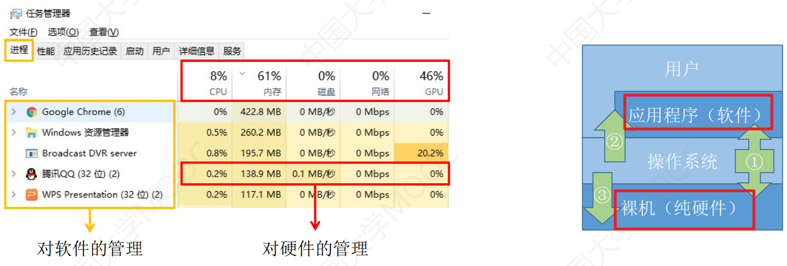

## 操作系统的功能和目标——作为系统资源的管理者
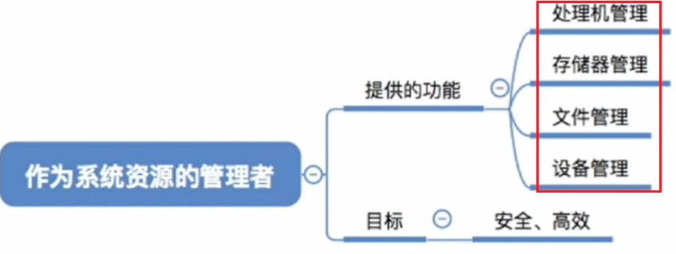

## 操作系统的功能和目标——向上层提供方便易用的服务
封装思想：操作系统把一些丑陋的硬件功能封装成简单易用的服务，使用户能更方便地使用计算机，用户无需关心底层硬件的原理，只需要对操作系统发出命令即可。

**GUI：图形化用户接口（Graphical User Interface）**
用户可以使用形象的图形界面进行操作，而不再需要记忆复杂的命令、参数。例子：在Windows操作系统中，删除一个文件只需要把文件“拖拽”到回收站即可。

联机命令接口实例（Windows系统）**联机命令接口**＝交互式命令接口
特点：用户说一句，系统跟着做一句
Step 1：win键＋R
Step 2：输入cmd，按回车，打开命令解释器
Step 3：尝试使用 time 命令

脱机命令接口实例（Windows系统）**脱机命令接口**＝批处理命令接口
使用windows系统的搜索功能，搜索C盘中的＊.bat文件，用记事本任意打开一个
特点：用户说一堆，系统跟着做一堆

程序接口：可以在程序中进行系统调用来使用程序接口。普通用户不能直接使用程序接口，只能通过程序代码间接使用。
如：写C语言“Hello world”程序时，在 printf 函数的底层就使用到了操作系统提供的显式相关的“系统调用”
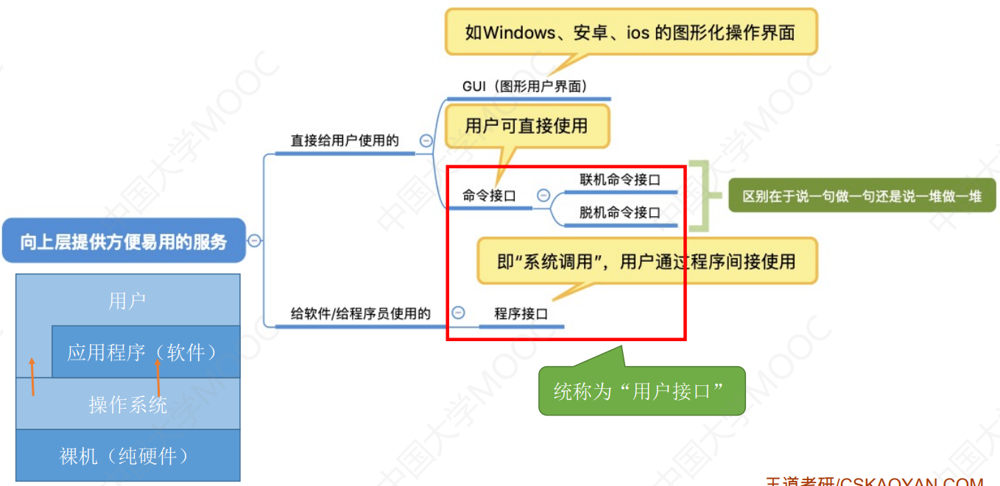

需要实现对硬件机器的拓展没有任何软件支持的计算机成为裸机。在裸机上安装的操作系统，可以提供资源管理功能和方便用户的服务功能，将裸机改造成功能更强、使用更方便的机器。
通常把覆盖了软件的机器成为**扩充机器**，又称之为**虚拟机**

# 2.操作系统的四个特征

## 操作系统的特征——并发
并发：指两个或多个事件在**同一时间间隔内发生**。这些事件宏观上是同时发生的，但微观上是交替发生的。
常考易混概念——并行：指两个或多个事件在**同一时刻同时发生**。

并行约会：同一时刻同时进行两个约会任务
并发约会：宏观上看，这一天老渣在同时进行两个约会任务。微观上看，在某一时刻，老渣最多正在进行一个约会任务

并发：指两个或多个事件在**同一时间间隔内发生**。这些事件**宏观上是同时发生的，但微观上是交替发生的**

操作系统的并发性指计算机系统中“同时”运行着多个程序，这些程序宏观上看是同时运行着的，而微观上看是交替运行的。操作系统就是伴随着“多道程序技术”而出现的。因此，操作系统和程序并发是一起诞生的。

> 注意（重要考点）：
> **单核CPU**同一时刻只能执行一个程序，各个程序只能**并发**地执行
> **多核CPU**同一时刻可以同时执行多个程序，多个程序可以**并行**地执行

比如Intel的第八代i3处理器就是4核CPU，意味着可以并行地执行4个程序。
即使是对于4核CPU来说，只要有4个以上的程序需要“同时”运行，那么并发性依然是必不可少的，因此并发性是操作系统一个最基本的特性。

## 操作系统的特征——共享
共享即资源共享，是指系统中的资源可供内存中多个并发执行的进程共同使用。

所谓的“同时”往往是宏观上的，而在微观上，这些进程可能是交替地对该资源进行访问的（即分时共享)生活实例：
互斥共享方式：使用QQ和微信视频。**同一时间段内摄像头只能分配给其中一个进程**。
同时共享方式：使用QQ发送文件A，同时使用微信发送文件B。宏观上看，两边都在同时读取并发送文件，说明两个进程都在访问硬盘资源，从中读取数据。微观上看，两个进程是交替着访问硬盘的。

## 操作系统的特征——并发和共享的关系
**并发性**指计算机系统中同时存在着多个运行着的程序。
**共享性**是指系统中的资源可供内存中多个并发执行的进程共同使用。

通过上述例子来看并发与共享的关系：使用QQ发送文件A，同时使用微信发送文件B。
1．两个进程正在并发执行（并发性）
2．需要共享地访问硬盘资源（共享性）

> 如果失去并发性，则系统中只有一个程序正在运行，则共享性失去存在的意义
> 如果失去共享性，则QQ和微信不能同时访问硬盘资源，就无法实现同时发送文件，也就无法并发

## 操作系统的特征——虚拟

虚拟是指把一个物理上的实体变为若干个逻辑上的对应物。物理实体（前者）是实际存在的，而逻辑上对应物（后者）是用户感受到的。
Yo～用一个例子来理解
背景知识：一个程序需要**放入内存**并给它**分配CPU**才能执行
GTA5需要4GB的运行内存，QQ需要256MB的内存，迅雷需要256MB的内存，网易云音乐需要256MB的内存．．．
我的电脑：4GB内存
问题：这些程序同时运行需要的内存远大于4GB，那么为什么它们还可以在我的电脑上同时运行呢？
答：这是虚拟存储器技术。实际只有4GB的内存，在用户看来似乎远远大于4GB

虚拟技术中的“空分复用技术“

某单核CPU的计算机中，用户打开了以下软件。。。

问题：既然一个程序需要被分配CPU才能正常执行，那么为什么单核CPU的电脑中能同时运行这么多个程序呢？
答：这是虚拟处理器技术。实际上只有一个单核CPU，在用户看来似乎有6个CPU在同时为自己服务

虚拟技术中的“时分复用技术”。微观上处理机在各个微小的时间段内交替着为各个进程服务

虚拟是指把一个物理上的实体变为若干个逻辑上的对应物。物理实体（前者）是实际存在的，而逻辑上对应物（后者）是用户感受到的。
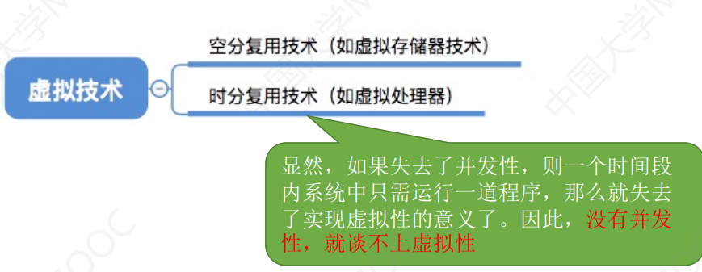

## 操作系统的特征——异步
异步是指，在多道程序环境下，允许多个程序并发执行，但由于资源有限，进程的执行不是一贯到底的，而是走走停停，以不可预知的速度向前推进，这就是进程的异步性。

如果失去了并发性，即系统只能串行地运行各个程序，那么每个程序的执行会一贯到底。**只有系统拥有并发性，才有可能导致异步性。**
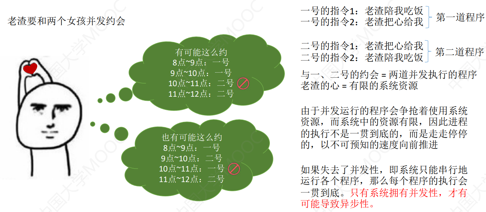

> 重要考点：
> 理解并发和并行的区别并发和共享互为存在条件
> 没有并发和共享，就谈不上虚拟和异步，因此并发和共享是操作系统的两个最基本的特征

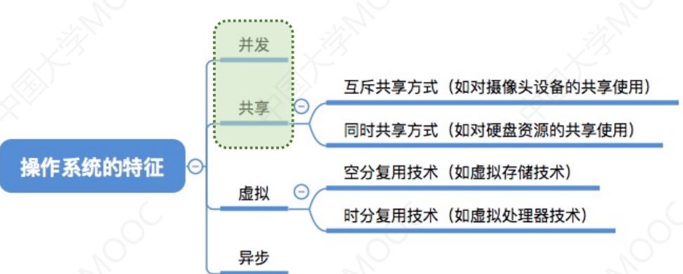

# 3.操作系统的发展与分类

## 手工操作阶段
主要缺点：用户独占全机、人机速度矛盾导致资源利用率极低
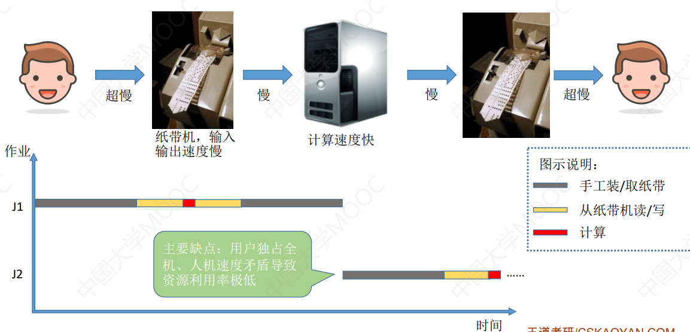

## 批处理阶段——单道批处理系统
引入脱机输入／输出技术（用外围机＋磁带完成），并由监督程序负责控制作业的输入、输出
引入脱机输入／输出技术，并由监督程序负责控制作业的输入、输出

主要优点：缓解了一定程度的人机速度矛盾，资源利用率有所提升。
主要缺点：内存中仅能有一道程序运行，只有该程序运行结束之后才能调入下一道程序。CPU有大量的时间是在
空闲等待I／O完成。资源利用率依然很低。
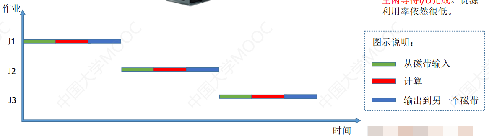

## 批处理阶段——多道批处理系统
主要优点：多道程序**并发**执行，**共享**计算机资源。资源利用率大幅提升，CPU和其他资源更能保持“忙碌”状态，系统吞吐量增大。
主要缺点：用户响应时间长，**没有人机交互功能**（用户提交自己的作业之后就只能等待计算机处理完成，中间不能控制自己的作业执行。eg：无法调试程序／无法在程序运行过程中输入一些参数）
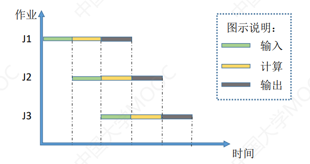

## 分时操作系统
分时操作系统：计算机以**时间片**为单位**轮流为各个用户／作业服务**，各个用户可通过终端与计算机进行交互。主要优点：用户请求可以被即时响应，**解决了人机交互问题**。允许多个用户同时使用一台计算机，并且用户对计算机的操作相互独立，感受不到别人的存在。
主要缺点：**不能优先处理一些紧急任务**。操作系统对各个用户／作业都是完全公平的，循环地为每个用户／作业服务一个时间片，不区分任务的紧急性。

## 实时操作系统

主要优点：能够优先响应一些紧急任务，某些紧急任务不需时间片排队。

在实时操作系统的控制下，计算机系统接收到外部信号后及时进行处理，并且要在**严格的时限内处理完事件**。实时操作系统的主要特点是**及时性和可靠性**
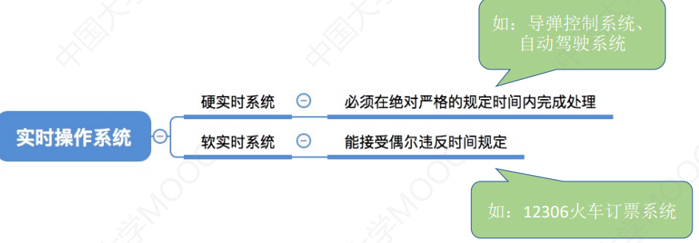

## 其他几种操作系统
网络操作系统：是伴随着计算机网络的发展而诞生的，能把网络中各个计算机有机地结合起来，实现数据传送等功能，**实现网络中各种资源的共享（如文件共享）和各台计算机之间的通信**。（如：Windows NT就是一种典型的网络操作系统，网站服务器就可以使用）

分布式操作系统：主要特点是**分布性和并行性**。系统中的各台计算机地位相同，**任何工作都可以分布在这些计算机上，由它们并行、协同完成这个任务**。

个人计算机操作系统：如Windows XP、MacOS，方便个人使用。

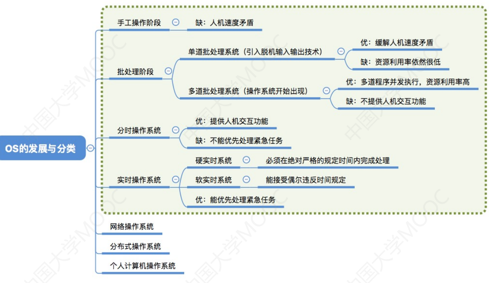

# 4.操作系统的运行机制

## 预备知识：程序是如何运行的？
一条高级语言的代码翻译过来可能会对应多条机器指令
程序运行的过程其实就是CPU执行一条一条的机器指令的过程
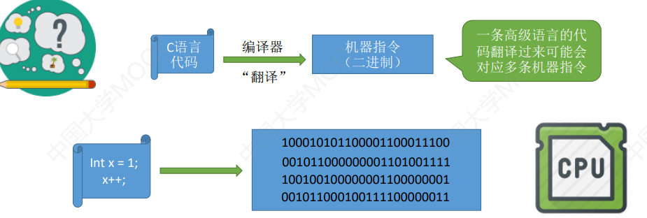

“指令”就是处理器（CPU）能识别、执行的最基本命令
注：很多人习惯把Linux、Windows、MacOS的“小黑框”中使用的命令也称为“指令”，其实这是“交互式命令接口”，注意与本节的“指令”区别开。本节中的“指令”指二进制机器指令

## 应用程序   内核
我们普通程序员写的程序就是“**应用程序**”
微软、苹果有一帮人负责实现操作系统，他们写的是“**内核程序**”。由很多内核程序组成了“**操作系统内核**”，或简称“**内核（Kernel）**”**内核**是操作系统最重要最核心的部分，也是**最接近硬件的部分**
甚至可以说，一个操作系统只要有内核就够了（eg：Docker→仅需Linux内核）
操作系统的功能未必都在内核中，如图形化用户界面GUI

## 特权指令和非特权指令
在CPU设计和生产的时候就划分了**特权指令和非特权指令**，因此CPU执行一条指令前就能判断出其类型
我们普通程序员写的程序就是“应用程序“
微软、苹果有一帮人负责实现操作系统，他们写的就是 内核程序
应用程序只能使用“非特权指令”，如：加法指令、减法指令等
操作系统内核作为“管理者”，有时会让CPU执行一些“特权指令”，如：内存清零指令。这些指令影响重大，只允许“管理者”——即操作系统内核来使用

## 内核态   用户态
CPU能判断出指令类型，但是它怎么区分此时正在运行的是内核程序or应用程序？
CPU有两种状态，“**内核态**”和“**用户态**”
处于内核态时，说明此时**正在运行的是内核程序**，此时**可以执行特权指令**
处于用户态时，说明此时**正在运行的是应用程序**，此时**只能执行非特权指令**
拓展：CPU中有一个寄存器叫**程序状态字寄存器（PSW）**，其中有个二进制位，1表示“内核态”，0表示“用户态”
**别名**：内核态＝核心态＝管态；用户态＝目态

一个故事：
①刚开机时，CPU为“**内核态**”，操作系统内核程序先上CPU运行
②开机完成后，用户可以启动某个应用程序
③操作系统内核程序在合适的时候主动让出CPU，让该应用程序上CPU运行(操作系统内核在让出CPU之前，会用一条特权指令把PSW的标志位设置为“用户态”)
④应用程序运行在“用户态”
⑤此时，一位猥琐黑客在应用程序中植入了一条特权指令，企图破坏系统...
⑥CPU发现接下来要执行的这条指令是特权指令，但是自己又处于“用户态”
⑦这个非法事件会引发一个**中断信号**
CPU检测到中断信号后，会立即变为“核心态”，并停止运行当前的应用程序，转而运行处理中断信号的内核程序
⑧“中断”使操作系统再次夺回CPU的控制权
⑨操作系统会对引发中断的事件进行处理，处理完了再把CPU使用权交给别的应用程序

内核态→用户态：执行一条**特权指令**——**修改PSW**的标志位为“用户态”，这个动作意味着操作系统将主动让出CPU使用权
用户态→内核态：由**“中断”**引发，**硬件自动完成变态过程**，触发中断信号意味着操作系统将强行夺回CPU的使用权

# 5.中断和异常

## 中断的作用
“中断”会使CPU由用户态变为内核态，使操作系统重新夺回对CPU的控制权

CPU上会运行两种程序，一种是**操作系统内核程序**，一种是**应用程序**

在合适的情况下，操作系统内核会把CPU的使用权主动让给应用程序（第二章进程管理相关内容）

“中断”是让操作系统内核夺回CPU使用权的**唯一途径**
如果没有“中断”机制，那么一旦应用程序上CPU运行，CPU就会一直运行这个应用程序

内核态→用户态：执行一条特权指令——修改PSW的标志位为“用户态”，这个动作意味着操作系统将主动让出CPU使用权
用户态→内核态：由“中断”引发，硬件自动完成变态过程，触发中断信号意味着操作系统将强行夺回CPU的使用权

## 中断的类型
1.内中断——与当前执行的指令**有关**，中断信号来源于**CPU内部**
2.外中断——与当前执行的指令**无关**，中断信号来源于**CPU外部**

