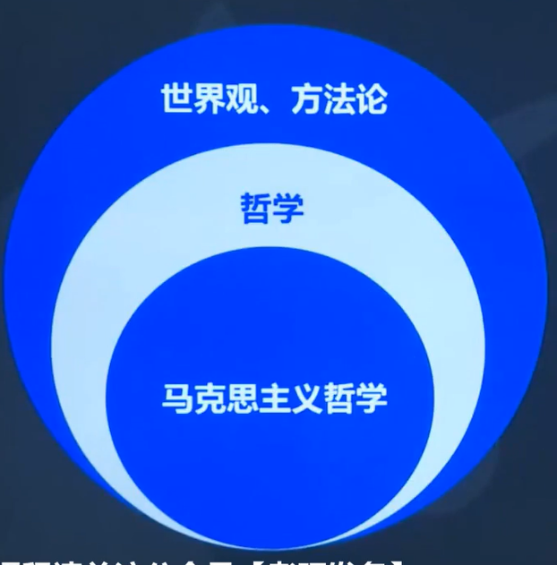

# 基础课

1.4小时
2.课时短
马原（24分）——思修——史纲——毛中特——当代时政

马克思主义哲学
1.哲学基本问题，不同流派
2.马哲
- 唯物论——世界的本原是什么？
- 辩证法——世界是怎么样的？
- 认识论——如何认知世界？
- 唯物史观——人类历史发展规律？

马克思主义政治经济学
资本主义以前的商品经济是简单商品经济；资本主义之后是发达商品经济时期
1.简单商品经济时期
2.发达商品经济时期
- 自由竞争的资本主义√
- 垄断竞争的资本主义

科学社会主义理论
1.社会主义
2.共产主义

