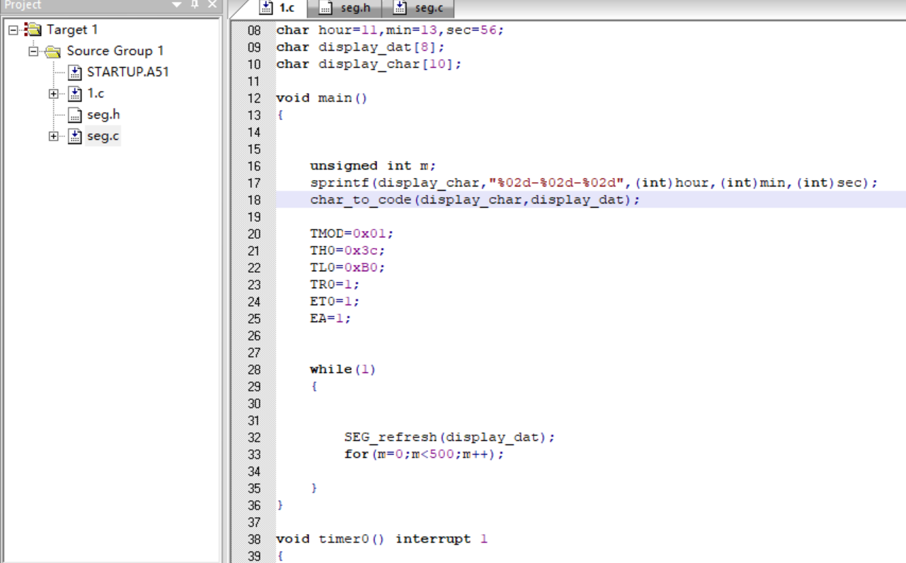
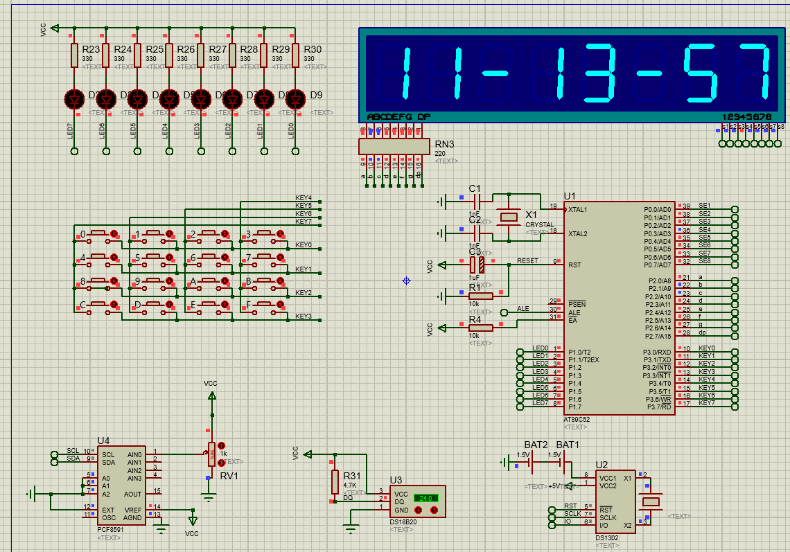

# 代码

```c
//1.c
#include"REG51.h"
#include"intrins.h"
#include "stdio.h"
#include "seg.h"

char hour=11,min=13,sec=56;
char display_dat[8];
char display_char[10];

void main()
{
	unsigned int m;
	sprintf(display_char,"%02d-%02d-%02d",(int)hour,(int)min,(int)sec);		 
	char_to_code(display_char,display_dat);

	TMOD=0x01;
	TH0=0x3c;
	TL0=0xB0;
	TR0=1;
	ET0=1;
	EA=1;
	
	while(1)
	{
		SEG_refresh(display_dat);
		for(m=0;m<500;m++);	   
	}
}

void timer0() interrupt 1
{
	static char times=0;
	TH0=0x3c;
	TL0=0xB0;
	times++;
	if(times==20)
	{
		times=0;
		if(++sec==60)
		{
			sec=0;
			if(++min==0)
			{
				min=0;
				if(++hour==24) hour=0;
			}
		}	
	}
	
	sprintf(display_char,"%02d-%02d-%02d",(int)hour,(int)min,(int)sec);		 
	char_to_code(display_char,display_dat);
}
```

```c
//seg.h
void SEG_refresh(unsigned char *p);
void char_to_code(unsigned char *p,unsigned char *q);
```

```c
//seg.c
#include"REG51.h"
#include"intrins.h"
#include "stdio.h"
#include "seg.h"

unsigned char code display_code[]={'C',0xc6,' ',0xff,'0',0xc0,'1',0xf9,'2',0xa4,'3',0xb0,'4',0x99,'5',0x92,'6',0x82,'7',0xf8,'8',0x80,'9',0x90,'-',0xbf};

void SEG_refresh(unsigned char *p)
{
	static char x=0xfe;	   // 1111 1110
	static unsigned int i=0;

	P2=0xff;
	P0=x;
	P2=p[i];
	x=_crol_(x,1);
	i++;
	if(i==8)  i=0;

}

void char_to_code(unsigned char *p,unsigned char *q)	 //	display_char是p,display_dat是q
{
	unsigned int i,j,k;
	for(k=0,j=0;k<8;j++,k++)
	{
		  for(i=0;i<13;i++)
		  {
		  	if(p[j]==display_code[2*i])
			{
				q[k]=display_code[2*i+1];
				break;
			}
			if(p[j+1]=='.')
			{
				q[k]=q[k] & 0x7f;//将最高位置为0，即显示小数点		  
				j++;
			}
		  }
	}
}
```

