# 01.单片机

把**CPU**、存储器、和输入／输出接口电路**集成在一个芯片上，这就是单片机。

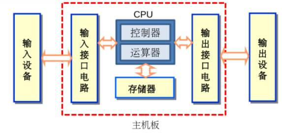

单片机是集成在一块（单）芯片上的微型计算机。

MCU:Micro-Controller Unit，微控制器

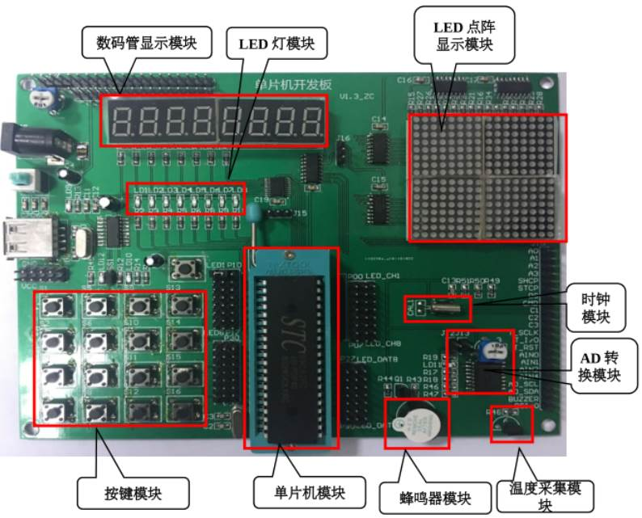

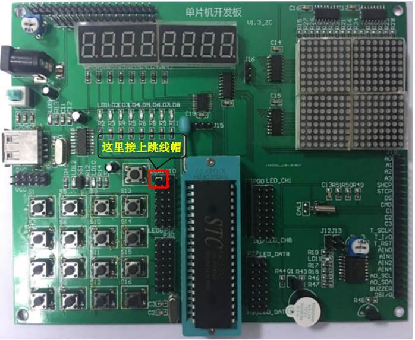

点亮LED灯硬件连线

 

## 软件使用

### 1.Keil

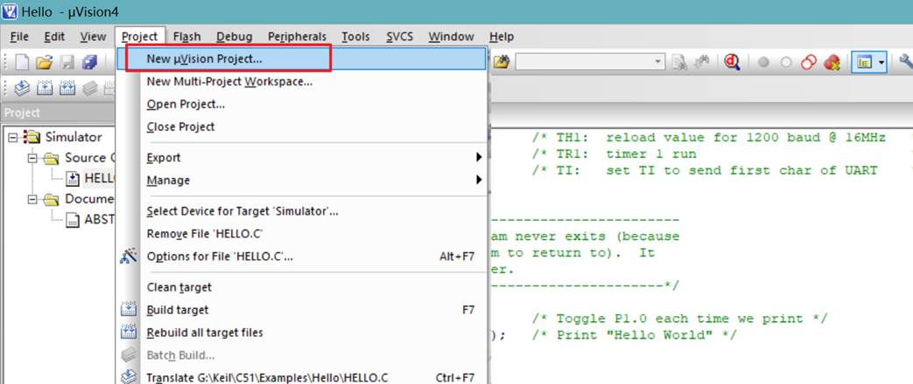
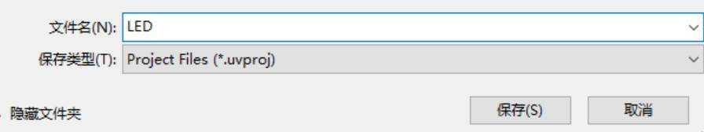
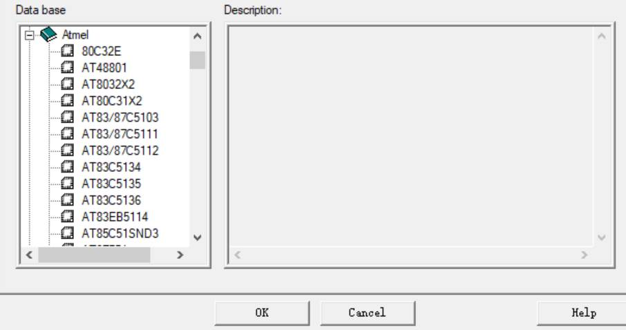
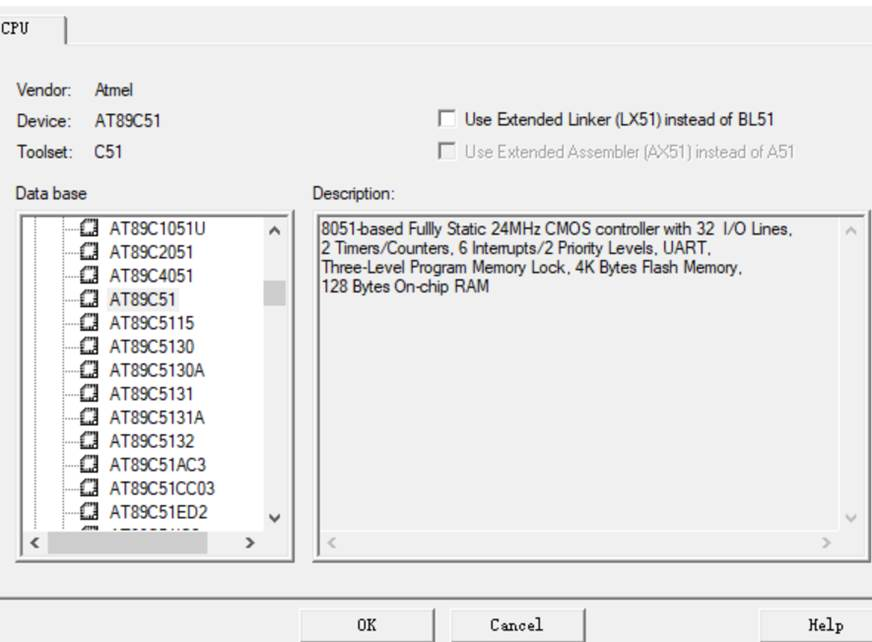
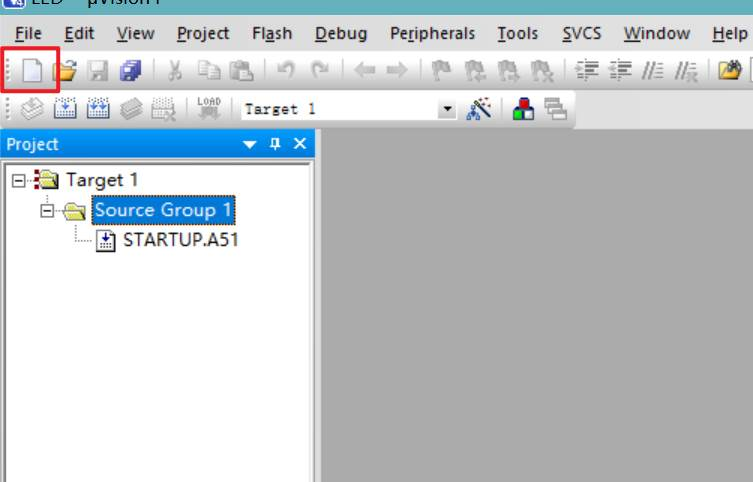
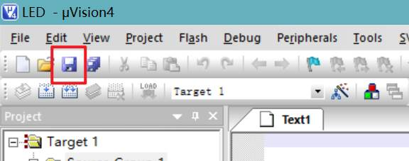
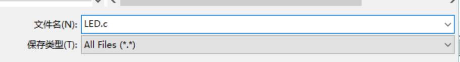
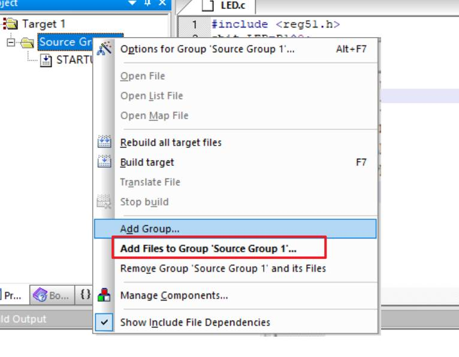
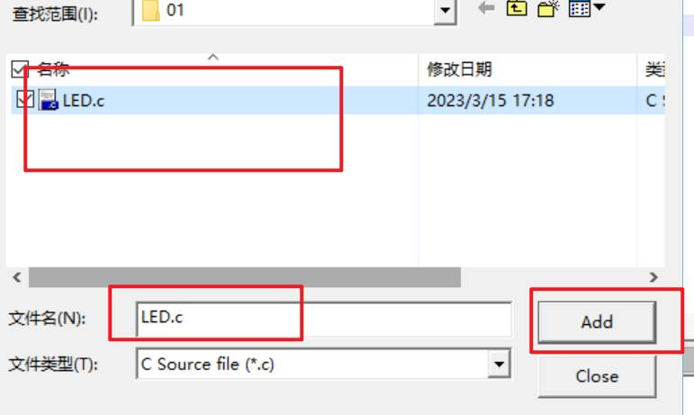
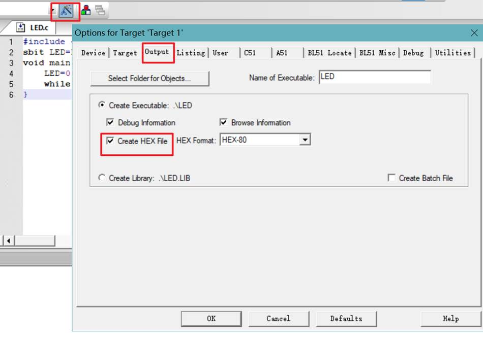
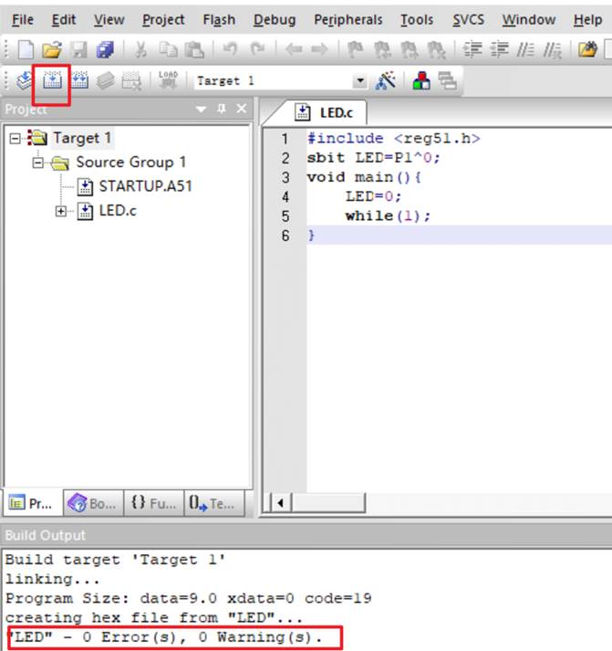

### 2.STC-ISP
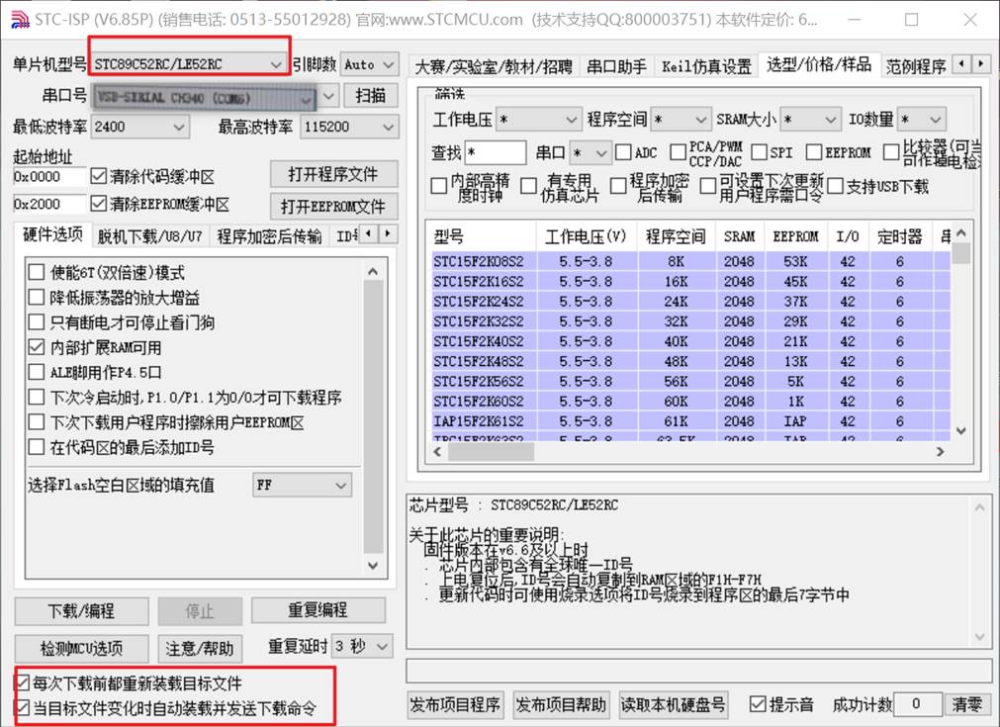

# 02.RAMROM

## 第一个程序：点亮小灯

```c
#include <reg51.h>
sbit LED=P1^0;
void main(){
	LED=0;
	while(1);
}
```
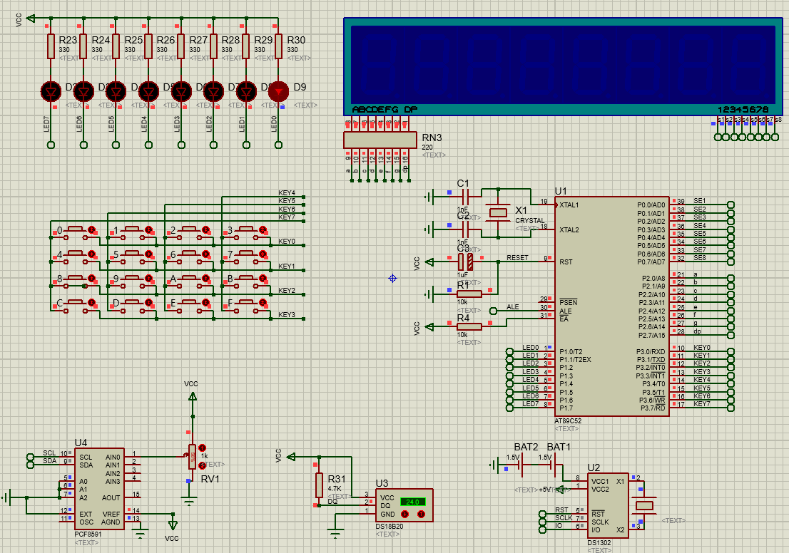

## 逻辑运算规则

1.逻辑“与”运算（AND）：
  ΟΛ0=0, 0Λ1=0, 1Λ0=0, 1Λ1=1
2.逻辑“或”运算（OR）：
  0v0=0, 1v0=1, 0v1=1, 1V1=1
3.逻辑“非”运算（NOT）：非1 = 0
  非0 = 1
4.逻辑“异或”运算（XOR）：0Φ0=0 0Φ1=1
  1Φ0=1
  1Φ1=0

## 计算机中数的表示

1）计算机中数的单位
·数的最小单位：bit（比特，一个二进制位）0或1
·数的基本单位：Byte（拜特，字节）
1Byte＝8bit（1字节＝8位）
1KB=2^10Byte=1024 B
1MB=2^10KB=220B=1048576 B
1GB=2^10MB=220KB=230B
1TB=2^10GB=220MB=230KB=240B
1PB=2^10 TB
1EB=2^10 PB
1ZB=2^10EB
1YB=2^10 ZB
1BB=2^10YB
1NB=2^10 BB
1DB=2^10 NB

## ROM : Read Only Memory,只读存储器

特点：可随机读数据，不能随机写数据
系统断电后，数据不会丢失。
用途：存放程序——程序存储器

程序存储器不但可以放程序，还有可以放数据，若要放数据需要在数据类型的后面加关键词code，例如：`char code x=32;`
注意点：上面的语句是将x安排在程序存储器，必须在定义时就初始化，在程序中不可以再赋值

4K 字节容量
1KB=1024字节
4KB＝4096字节
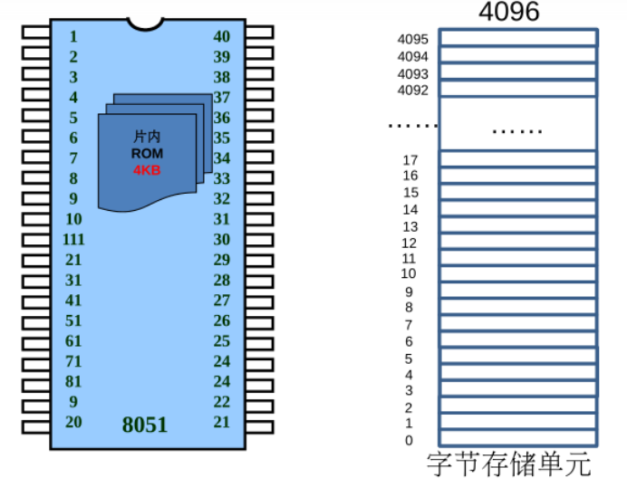

单片机内部程序存储器（ROM）
用户无须考虑程序的存放地址，编译程序会在编译过程中自动安排程序的存放地址。
0地址存放程序的第一条指令
EA引脚接高电平，无需外扩程序存储器。
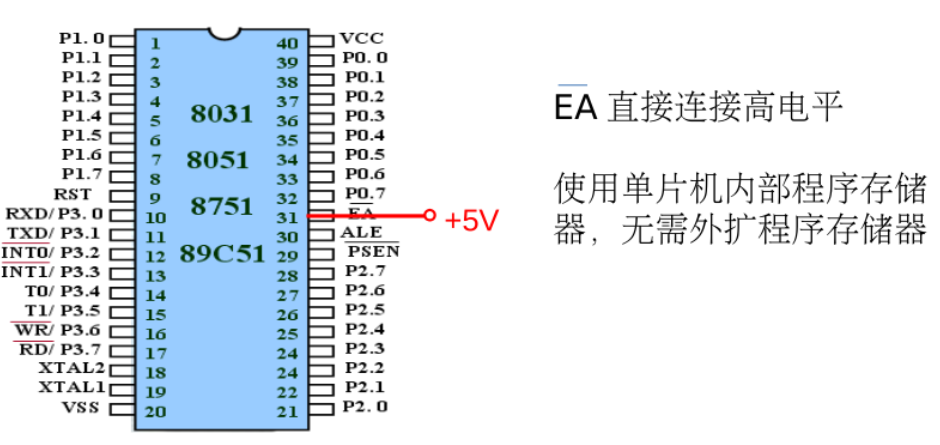

## 数据存储器

RAM:Random Access Memory，随机存取存储器
特点：可以随机读写数据，
掉电内容丢失容量：128x8
用途：存放中间结果或临时数据——数据存储器

这128字节的数据存储器怎样使用呢？其实，我们采用C语言编程的话，只要按照要求定义各类变量就可以了，不需要我们来具体考虑怎样存放这些中间变量，这也是我们采用C语言编程的好处，我们不需要了解太多单片机内部的结构。

说明：这128字节的数据存储器其中有16个字节可以按位寻址，也就是说我们可以定义的最小变量类型是位类型bit，例如：`bit x;` x的取值只有两种0和1

## 单片机数据存储器

接下来我们走进MCS—51单片机的内部RAM即数据存储器仓库中，大家想象一下，摆在我们面前的是一层层的“抽屉”，也就是存储单元，每个“抽屉”拉开是8个格子，每个格子里不是“0”就是“1”，每个抽屉的外面都有编号，也就是存储单元地址，编号按顺序从00H到FFH，共256个存储单元。这256个单元是可以在线写入和读出数据，也就是可以用C语言中的赋值运算符“＝”向这些存储单元中写入数据。
内部数据存储器从中间一分两，00H～7FH的低128字节单元地址空间为数据存储器RAM区，而80H～FFH的高128字节单元地址空间，为单片机特殊功能寄存器区，下面我们详细介绍这个区域。
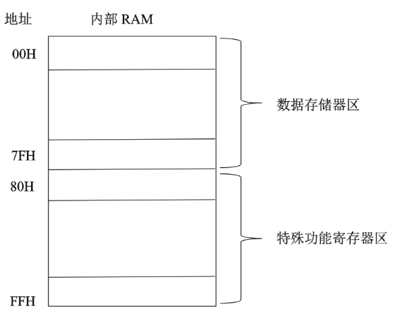

## 一、数据存储RAM区
如图3.2所示，数据存储RAM区的地址空间又分为三部分，分别是00H～1FH为**工作组寄存器区**、20H～2FH为**可位寻址区**、30H～7FH为一般RAM区。
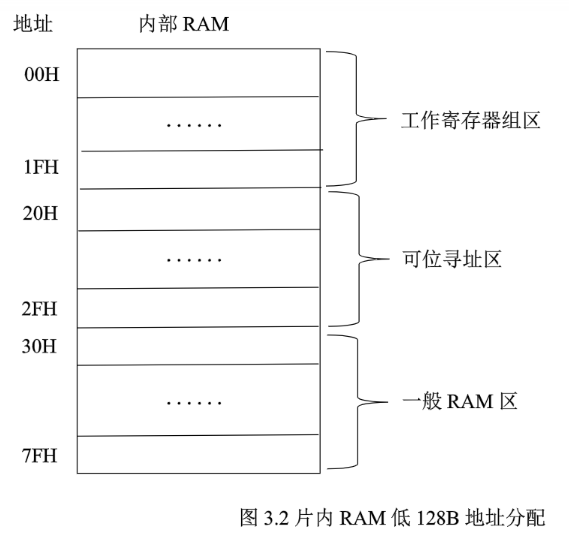

对于使用C51编程，工作组寄存器区对于程序员来说是透明的，所以我们在这儿不做详细讲解。
可位寻址区，大家可以这么想象一下，上面我们说每个存储单元好比是个抽屉，抽屉打开里面有8个格子，而这个区域的每个抽屉打开发现有8个小抽屉，CPU可以独立读／写这些小抽屉，因为有了这些可以独立读／写的位，所以我们在用C51编程时，最小的变量可以定义为位，定义格式如下：
`bit x; `

当然可位寻址区也可以分配其他类型的变量，C51 与标准 C 语言区别很明显的地方。
C51中可以指定变量存储在具体的存储器区域内，若程序员想在该区域内定义一个int变量，可以在类型后加 bdata，如下：
`int bdata test;`
该test 变量就会被分配在可位寻址区，因为可位寻址区CPU是可以按位访问的，也就是CPU可以只访问该test变量中的一位，例如，若想将 test 变量的最低位赋为1，可以用sbit先定义test的最高位，再赋值，如下：
`sbit test_0=test^0; test_0=1;`

这里要注意一下sbit和bit的区别：
bit定义的是位变量，编译器在编译过程中分配的地址是随机的；
sbit是对应可位寻址空间的一个位，sbit大部分是用在特殊功能寄存器（后面讲解）中的，方便对特殊功能寄存器的某位进行操作的。
一般RAM区，也就是一般的存储单元，该区域的存储单元即不能做工作组寄存器使用，也不能按位访问。
总之，在用C51编程时，该区域是用来分配变量空间的，C51中变量定义类型、占用空间及变量范围如表3.1所示。
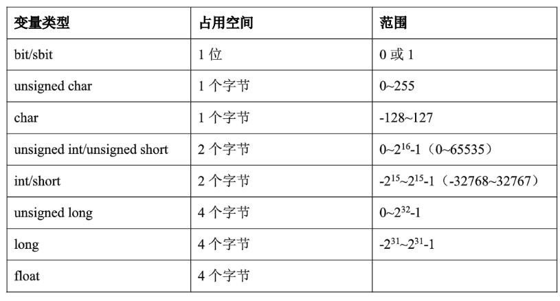

## 二、特殊功能寄存器区
如图3.1所示，MCS—51系列单片机在内部RAM的高128字节单元地址区域集成了20多个特殊功能寄存器（SFR）区，这些寄存器除了具有可以在线访问（读／写）功能外，顾名思义，还具有特殊的功能要求。具体具有哪些特殊功能，我们在后面讲解各个模块时再一一详细介绍，这些寄存器是我们这门课的重点，可以这么说，若掌握了这些寄存器的使用，就熟悉掌握了MCS—51芯片的开发应用。表3.2中列出了8051中这些寄存器的情况。
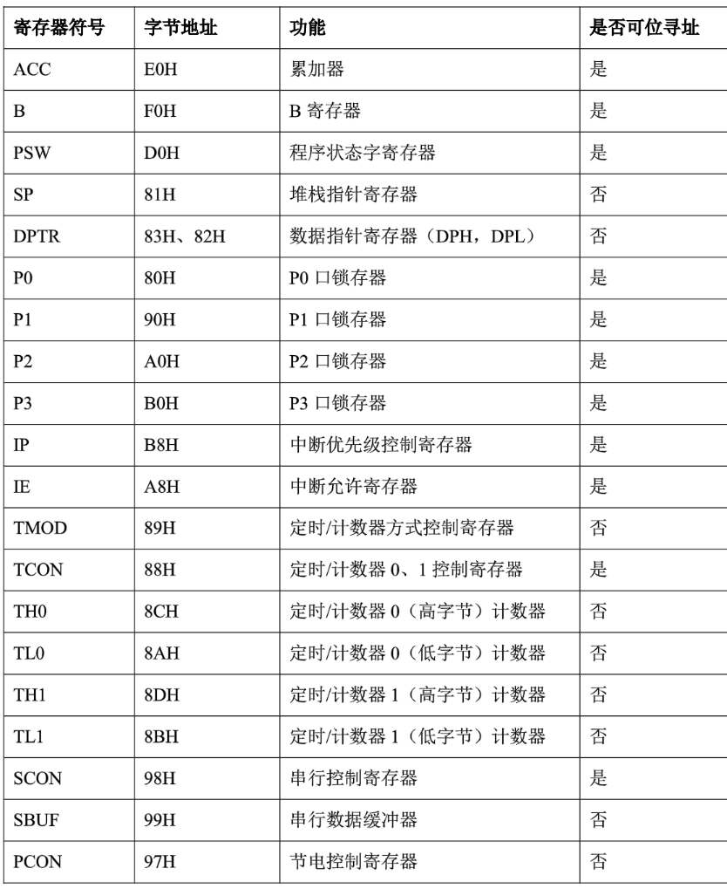
在使用C51编程时，若使用以上特殊功能寄存器，都必须先用sfr定义再使用，例如定义P0口锁存器，可用如下的定义语句：
`sfr P0=0x80;`
上句话的意思是：定义特殊功能寄存器P0，并且规定P0的地址值为80H。注意这里的“＝”不能理解为赋值运算符，而是表示P0的地址。大家还要注意“sfr”与“char”区别，例如下面的定义语句：

`char x=0x80;`
用char定义的x，系统是任意分配数据存储单元，这里的“＝”是赋值运算符，这句话的意思是定义了一个变量x，并给x赋了个初值0x80。但上面的P0和x的共同点是大小都是一个字节。

表3.2中指出，P0寄存器是可以按位寻址的，也就是CPU可以单独对P0寄存器的每个位单独赋值，而不影响其他的位，例如上面的例子，我们可以单独对PO寄存器的第0位赋值，首先我们要先用sbit对P0寄存器的第0位进行定义：
`sbit P0_0=P0^0;`
该定义语句的意思是将P0寄存器的第0位定义为P0＿0，你也可以定义为其他的名称，例如该位是控制LED灯的，可以定义为LED，这样更形象一点。定义了该位后，我们可以直接对该位赋值：

```c
P0_0=0;／／将P0寄存器的第0位赋值为0，P0寄存器的其他位不受影响
P0_0=1;／／将P0寄存器的第0位赋值为1，P0寄存器的其他位不受影响
```
这里需要说明的是，表3.2中的特殊功能寄存器在keil软件里的“reg51．h”中都已定义好了，程序员完成可以不用自己定义这些寄存器，只要在需要的源程序文件里开头加上“＃include＜reg51．h＞”就行了。

下面我们结合点亮LED灯实验，重点介绍P0、P1、P2、P3特殊功能寄存器，看看他们的特殊功能体现在哪儿？大家回想一下，P0、P1、P2、P3这四个名称我们还在哪儿用过？对了，我们上次课介绍单片机引脚功能时介绍过输入／输出口P0口、P1口、P2口、P3口，那PO、P1、P2、P3寄存器跟PO口、P1口、P2口、P3口有什么联系呢？他们的联系就是，当四个I／O口作为输出功能时，P0、P1、P2、P3寄存器的某一位为0，P0口、P1口、P2口、P3口对应的引脚就是低电平，P0、P1、P2、P3寄存器的某一位为1，PO口、P1口、P2口、P3口对应的引脚就是高电平（＋5V），例如P1寄存器的第0位为0，那P1口的第0个脚也就是P1.0则会输出低电平，P1寄存器的第0位为1，那P1口的第0个脚也就是P1.0则会输出高电平。
综上所述，我们终于可以自己写出点亮LED的程序了。
```c
#include <reg51.h>
sbit LED=P1^0;  ／／P1寄存器的最低位定义为LED
void main(){
	LED=0;      ／／将LED位赋为0，这时外部引脚P1.0就会输出低电平，LED会亮。
	while(1);
}
```

```c
#include <reg51.h>
void main(){
	P1=0;
	while(1);
}
```
P1=0时，8个小灯都亮了

### 特殊功能寄存器Special Function Register(SFR）

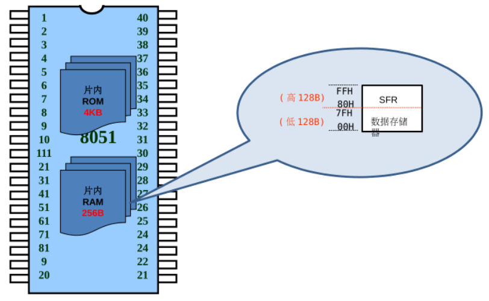
- 在这128个字节单元中，SFR其实只占用了21个单元，这21个单元的地址地址是不连续的
- 没有出现在这里的单元是为单片机硬件升级的时候预留下来的，我们是不能使用的。
- 在程序设计中，只要我们对这些寄存器进行控制，也就控制了单片机的硬件了。
- 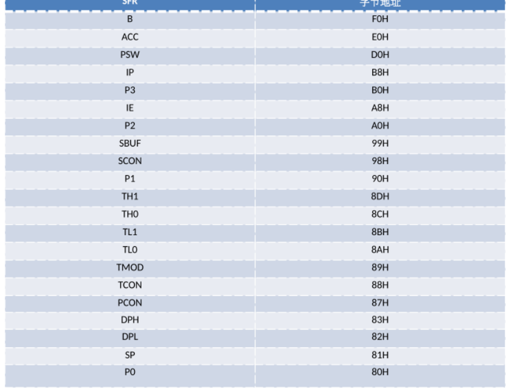

sfr——定义寄存器的名字和地址的对应关系
```c
sfr P0=0x80;／／特殊功能寄存器PO的地址是
0x80P0=0x55;／／把十六进制数55H（01010101）赋值给PO寄存器
```
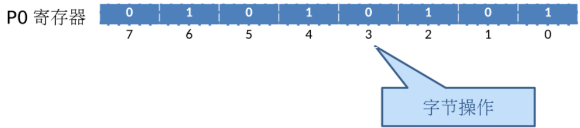

有部分SFR还可以位操作，它们对应的地址都能被8整除
位和字节的关系就像组员和小组的关系一样，位是一个组员，小组是一个集体。
sbit——定义特殊功能寄存器中的可位寻址的位名称
`sbit LED=P1^0;／／定义SFR中的可寻址位LED=1;`
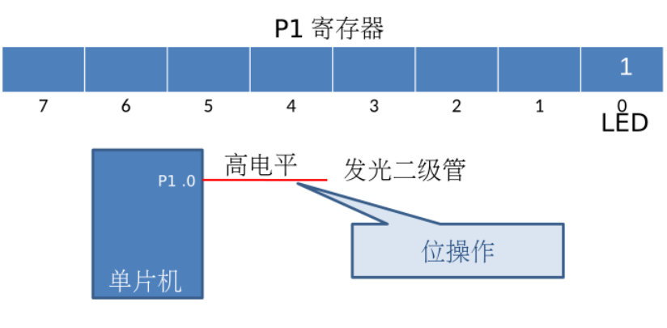

I／O接口特殊功能寄存器
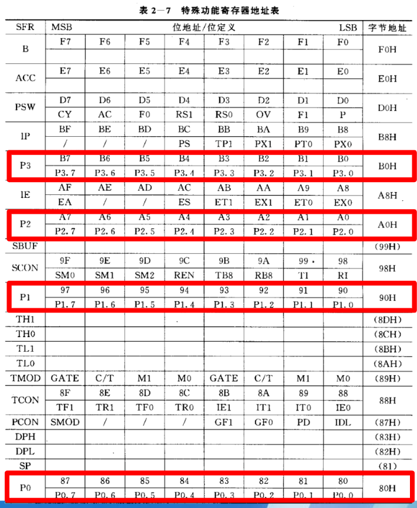

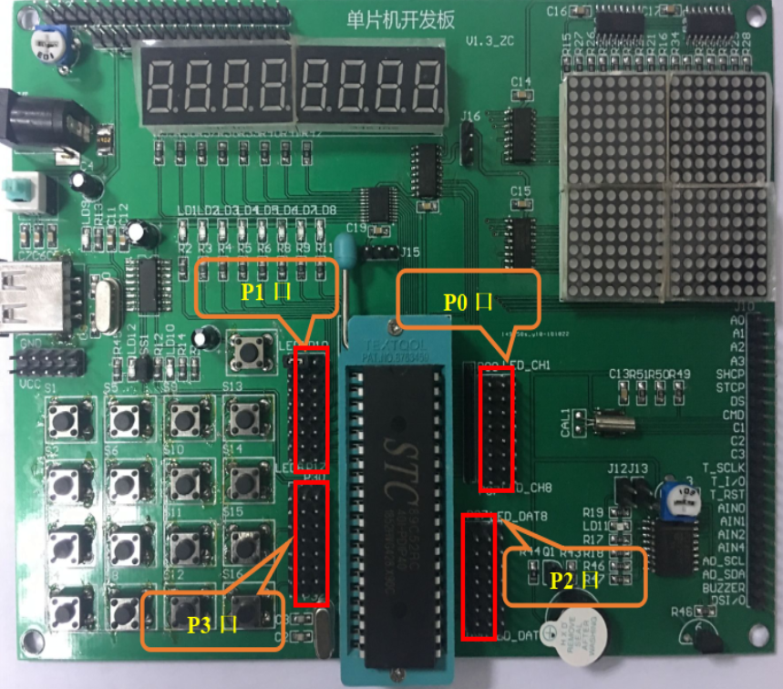

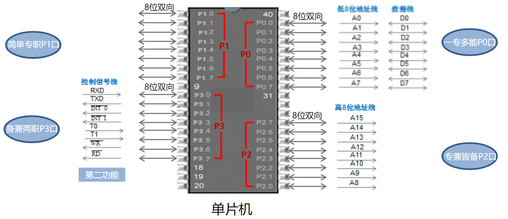


# 03.点亮小灯

## 第一种代码

```c
#include <reg51.h>
void main(){
	P1=0;		//灯亮
	while(1);
}
或者
#include <reg51.h>
void main(){
	while(1);
    P1=0;		//灯亮
}
//P1口的8个灯都亮了
```

## 第二种方法：直接定义位

```c
#include <reg51.h>
sbit LED=P1^0;//直接定义P1口0号位
void main(){
	LED=0;		
	while(1);
}
```

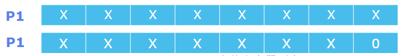

## 第三种方法：位操作运算


```c
#include <reg51.h>
void main(){
	P1&=P1 & 0xfe;		 //亮一个灯
	while(1);
}
```

 xxxx xxxx
&1111 1110
 xxxx xxx0
&xxxx xxxx
 xxxx xxx0


C语言中的 &= 意思为：按位与后赋值
代码示例为：
x = 0x02; 
x &= 0x01; 
按位与后的结果为：0x00
 0000 0010
&0000 0001
 0000 0000

## 第四种方法：位操作运算

```c
#include <reg51.h>
void main(){
	P1 &= ~(1<<0);  //灯亮
	while(1);
}
```

左移运算符<<(左移)运算规则：按二进制形式把所有的数字向左移动对应的位数，高位移出(舍弃)，低位的空位补零。语法格式：需要移位的数字 << 移位的次数例如： 3 << 2，则是将数字3左移2位计算过程：3 << 2 首先把3转换为二进制数字0000 0011，然后把该数字高位(左侧)的两个零移出，其他的数字都朝左平移2位，最后在低位(右侧)的两个空位补零。则得到的最终结果是0000 1100，则转换为十进制是12。

~0000 0001
 1111 1110
&xxxx xxxx
 xxxx xxx0

例如：
P1＝P1＆～（（1＜＜0）｜（1＜＜3））；／／将P1的 第0位、第3位清零
	0000 0001 | 0000 1000 = 0000 1001
	~0000 1001=1111 0110
	xxxx xxxx & 1111 0110 = xxxx 0xx0
P1＝P1 ｜（（1＜＜1）｜（1＜＜4））；／／将P1的 第1位、第4位置1
	0000 0010 | 0001 0000 = 0001 0010
	xxxx xxxx | 0001 0010 = xxx1 xx1x
P1＝P1＾（（1＜＜1）｜（1＜＜4））；／／将P1 的第1位、第4位取反
	0000 0010 | 0001 0000 = 0001 0010
	xxxx xxxx ^ 0001 0010 = xxx_ xx_x

在C语言里这个符号“ ∧ ”表示“按位异或”运算符。
例：
^ 按位异或
AND (位与&) OR ( 位或| ) XOR ( 位异或^ )
1 & 1 = 1， 1 | 1 = 1， 1 ^ 1 = 0
1 & 0 = 0， 1 | 0 = 1， 1 ^ 0 = 1
0 & 1 = 0， 0 | 1 = 1， 0 ^ 1 = 1
0 & 0 = 0， 0 | 0 = 0， 0 ^ 0 = 0

# 04.左移右移与或异或

## 左移运算：＜＜

a<<b
a＝182；转换成二进制形式 1011 0110
b=1时，最左边的1被移走了，最右边添0。a<<b=01101100
b=4时，最左边的4位被移走了，最右边添0。a<<b=0110 0000

## 右移运算：>>

运算法则：无符号操作数右移若干位后，低位丢弃，高位补0。
把a中的高4位和b中的低4位取出来，a中的高4位在前，b中的低4位在后，合并出一个新的数c，怎么做呢？

```c
P1<<=1;  ／／把P1口的内容左移一位再赋值给P1
a>>=4;  ／／把a的内容右移4位再赋值给a变量
```

## 位运算

在二进制位的级别上进行的一系列运算。

### 按位与运算：&

运算法则：有 0 出 0，全 1 出 1

| a    | b    | a&b  |
| ---- | ---- | ---- |
| 0    | 0    | 0    |
| 0    | 1    | 0    |
| 1    | 0    | 0    |
| 1    | 1    | 1    |

`x&0=0  //× 代表 0 或者1`
`x&1=x  //x 代表0 或者1`
 xxxx xxxx    x代表0或者1
&1111 0000
 xxxx 0000

### 按位或运算：

运算法则：有1 出 1，全0出 0

| a    | b    | a \| b |
| ---- | ---- | ------ |
| 0    | 0    | 0      |
| 0    | 1    | 1      |
| 1    | 0    | 1      |
| 1    | 1    | 1      |

`x | 0=x    ／／x代表0或者1`
`x | 1=1    ／／x代表0或者1`

 xxxx xxxx
|0011 1100
xx11 11xx

### 按位异或运算：

运算法则：相同为0，不同为1

| a    | b    | a^b  |
| ---- | ---- | ---- |
| 0    | 0    | 0    |
| 0    | 1    | 1    |
| 1    | 0    | 1    |
| 1    | 1    | 0    |

P1=P1^0x5b
 11110000
^ 01011011
 10101011
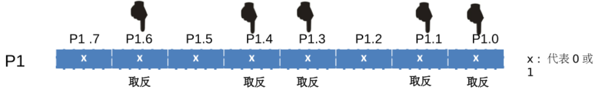

### 按位取反运算：～

运算法则：把1变0，把0变1

| a    | ~a   |
| ---- | ---- |
| 0    | 1    |
| 1    | 0    |

P1=~P1;
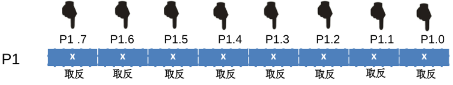

按位与＆：将一个二进制数的指定位清0
按位或｜：将一个二进制数的指定位置1
按位异或^：将一个二进制数的指定位取反
按位取反～：将一个二进制数的所有位都取反

```c
P1=P1&0xf0
P1=P1|0x3a
P1=P1^0x5b
P1=~P1

P1&=0xf0
P1|=0x3a
P1^=0x5b
```


# 05.灯闪

```c
#include <reg51.h>
void main
{
	while(1)
	{
		P1=0;  //灯亮
		P1=1;  //灯灭
	}
}
```

使用这个方法，发现灯是常亮，没有闪烁，原因是在该代码中灯亮后就立马执行灯灭，CPU执行灯亮或灯灭的语句只需要几微秒的时间，也就是灯亮、灯灭的频率太快了，眼睛来不及反应，所以看着是常亮的状态，要改变这个现象我们要在灯亮和灯灭后延时一段时间，延时我们可以用CPU循环执行空语句很多次就行了，加上延时语句后代码如下：

## 都亮

```c
#include <reg51.h>
void main()
{
	int i;
	while(1)
	{
		P1=0;  //灯亮
		for(i=0;i<=10000;i++);		//延时
		P1=1;  //灯灭
		for(i=0;i<=10000;i++);  	//延时
	}
}
```

我们将以上代码编译下载到单片机中并运行，发现接在P1口的第0脚上的LED闪烁，实验成功。但我们要是把8个LED等接到P1口上，我们发现所有LED都闪烁，我们只需要一盏LED灯闪烁，其他灯不闪烁，让怎么办呢？我们可以利用上次的内容，从两个方面
改进，一个是直接定义位，对位赋值。代码如下：

## 一个亮

```c
#include <reg51.h>
sbit LED=P1^0;
void main()
{
	int i;
	while(1)
	{
		LED=0;  //灯亮
		for(i=0;i<=10000;i++);		//延时
		LED=1;  //灯灭
		for(i=0;i<=10000;i++);  	//延时
	}
}
```

这里还可以进一步简化程序，我们发现“LED=0;”和“LED=1;”是相反的两条语句，我们可以利用“~”位取反操作符直接对指定的位取反，上面的灯闪实验可以改写成如下代码：

```c
#include <reg51.h>
sbit LED=P1^0;
void main()
{
	int i;
	while(1)
	{
		LED=~LED;  
		for(i=0;i<=10000;i++);		//延时

	}
}
```

正如上次说的，有的寄存器不支持按位赋值，那上面的代码就不可行，我们可以使用上次课的方法，将代码改写如下：

```c
#include <reg51.h>
sbit LED=P1^0;
void main()
{
	int i;
	while(1)
	{
		P1 &=~(1<<0);//灯亮
		for(i=0;i<=10000;i++);
		P1 |=(1<<0);//灯灭
		for(i=0;i<=10000;i++);
	}
}
```

 xxxx xxx1   0000 0001  
&1111 1110
 xxxx xxx0    不管最右边的是0还是1，都要把它变为0

其实灯亮灯灭刚好是两个相反的过程，我们可以直接使用让灯取反操作就行了，其他位不变的语句就行了，可以简化代码如下：

```c
#include <reg51.h>
void main()
{
	int i;
	while(1)
	{
		P1^=(1<<0);       //灯状态取反
		for(i=0;i<=10000;i++);  //延时
	}
}
```

> int a = 0x02;  // 二进制为00000010
> a ^= 0x03;     // 二进制为00000011
>
> 上述代码中，`^=`运算符对变量a进行异或操作，并将结果赋值给a。执行该代码后，a的二进制值会变为00000001，即二进制下的1。这是因为，a的二进制值为00000010，0x03的二进制值为00000011，两者进行异或操作后，得到的二进制值为00000001，即十进制下的1。
>
> 需要注意的是，异或赋值操作符只对整数类型的变量或表达式进行操作。如果左侧或右侧操作数不是整数类型，则编译器会报错。


# 06.流水灯

上次的流水灯实验，硬件上我们用8根导线分别将P1口的第0脚接到第0个灯，第1脚接到第1个灯，以此类推，直到将第7脚接到第7个灯上。软件上相信大家能想到的最简单的办法是先将第0个灯点亮，延时，再将1个灯点亮，再延时，依次类推直到将第7个灯点亮，延时，再将上面的步骤无限的循环执行，代码如下：

```c
#include <reg51.h>
void main()
{
	unsigned int i;
	while(1)
	{
		P1=0xFE;             
		//11111110B 第0个灯亮，其他的灯灭
		for(i=0;i<=10000;i++);  //延时
		P1=0xFD;             
		//11111101B 第1个灯亮，其他的灯灭
		for(i=0;i<=10000;i++);  //延时
		P1=0xFB;             
		//11111011B 第2个灯亮，其他的灯灭
		for(i=0;i<=10000;i++);  //延时
		P1=0xF7;             
		//11110111B 第3个灯亮，其他的灯灭
		for(i=0;i<=10000;i++);  //延时
		P1=0xEF;             
		//11101111B 第4个灯亮，其他的灯灭
		for(i=0;i<=10000;i++);  //延时
		P1=0xDF;             
		//11011111B 第5个灯亮，其他的灯灭
		for(i=0;i<=10000;i++);  //延时
		P1=0xBF;             
		//10111111B 第6个灯亮，其他的灯灭
		for(i=0;i<=10000;i++);  //延时
		P1=0x7E;             
		//01111111B 第7个灯亮，其他的灯灭
		for(i=0;i<=10000;i++);  //延时
	}
}
```

将上面的程序我们编译下载到单片机中运行，我们看到了LED灯依次点亮的流水灯效果。我们来分析一下上面的程序的还能不能优化。

我们发现点亮每个灯的语句都差不多，都是给P1赋值，然后延时，我们能不能用循环来做呢？能否用循环来做，取决于点亮每个灯的语句中不同部分是否有规律，若有规律我们就能用循环来写。我们发现从第0个灯到第7个灯点亮赋的值不同，这些值程序中使用的是16进制形式，看不出规律，但我们分析这些值的二进制（见上面程序的注释部分），发现每次赋的值是将上次赋的值循环左移了一下，初始值为0xFE，那我们有没有循环左移操作符呢？汇编语言中有循环左移指令，这里我们不做介绍，那C51中有循环移位运算符吗？答案是否定的。我们直接能想到的是C语言中有“<<”（左移）和“>>”（右移）运算符。下面我们详细复习一下这个运算符的使用。
1、“<<”（左移）
“<<”表达式的形式是：操作数<<n，意思是将操作数按二进制的形式，每位向左移n位，最右边空出来的n位统一全补0。例如0xFE<<1结果是多少呢？我们先把0xFE写成二进制形式111111110B，左移一位后得到11111100B，最后的结果是0xFA。
2、“>>”（右移）
“>>”表达式的形式是：操作数<<n，意思是将操作数按二进制的形式，每位向右移n>>位，这里要注意最左边空出来的n位，若操作数是无符号数则补0，若操作数是有符号数则>>补符号位。例如：
unsignedchar x=0xFE;
x=x>>1;
上面的语句x定义的是无符号字符型，x的初始值写成二进制是111111110B，x>>1后x的值为01111111B，空出的最高位补的是0。但若是下面的语句结果就不一样了。
char x=0xFE;
x=x>>1;
上面的语句x定义的是有符号字符型，x的初始值写成二进制是111111110B，注意了符号位是1，x>>1后x的值为11111111B，空出的最高位补的是符号位1。再看下面的语句。
char x=0x7E;
x=x>>1;
上面的语句x定义的是有符号字符型，x的初始值写成二进制是011111110B，注意了符号位是0，x>>1后x的值为00111111B，空出的最高位补的是符号位0。

## 移位函数

综上分析，C51没有直接的循环移位运算符，但在intrins.h头文件中已经定义了这些功能的函数，可以直接调用，移位函数有：
（1）unsigned char _cror_ (unsigned char, unsignedchar);无符号字符型变量循环右移位
函数。
（2）unsigned int  _iror_ (unsigned int,  unsigned char);无符号整型变量循环右移位函
数。
（3）unsigned long _lror_  (unsigned long, unsigned char);无符号长整型变量循环右移位
函数
（4）unsigned char _crol_ (unsigned char, unsigned char);无符号字符型变量循环左移位
函数。
（5）unsigned int  _irol_ (unsigned int,  unsigned char);无符号字符型变量循环左移位
函数。
（6）unsigned long _lrol_ (unsigned long, unsigned char);无符号字符型变量循环左移位
函数。
以上6个函数第一形参是循环移位的数据，第二形参是循环移位的次数，例如要将P0寄存器循环左移一位，函数的调用形式为：
`P0=_crol_ (P0, 1);`
所以上面的流水灯代码可以改写为循环结构：

## 代码

```c
#include <reg51.h>
#include <intrins.h>
void main()
{
	unsigned int i;
	P1=0xFE;
	while(1)
	{
		for(i=0;i<=10000;i++);  //延时
		P1=_crol_(P1, 1);//循环左移1位
	}
}
```

大家思考一下，如果没有这样的库函数，我们怎么自己写出循环左移1的功能代码呢？
我们分析发现，循环左移1位就是左移一位后，最右边空出来位补最左边移出去的那个位，我们可以先让操作数的值“左移”一位，最右边的位补的0，得到一个值1，再将操作数里的值右移7位，也就是,将被左移出去的最高位移到最低位上，得到值2，再将值1和值2或一下，就能实现循环左移功能了。例如，将P0循环左移一位我们可以写成如下代码：
`P0=(P0<<1) | ( P0>>7);`
上面的流水灯还可以用下面的代码实现：

```c
#include <reg51.h>
#include <intrins.h>
void main()
{
	unsigned int i;
	P1=0xFE;
	while(1)
	{
		for(i=0;i<=10000;i++);  //延时
		P1=(P1<<1) | ( P1>>7);//循环左移1位
	}
}
```

1111 1110
1111 1100 | 0000 0001 = 1111 1101
1111 1010 | 0000 0001 = 1111 1011
... = 0111 1111
1111 1110 | 0000 0000 = 1111 1110
1111 1100 | 0000 0001 = 1111 1101
1111 1010 | 0000 0001 = 1111 1011
...

# 07独立按键实验控制流水效果

## 双向流水灯

我们先讲解一下上次布置给大家的双向流水灯作业。该实验的现象很明确就是将我们已经做过的循环左移流水效果和循环右移流水效果重合起来，双向流水代码如下：

```c
#include <reg51.h>
#include <intrins.h>
void main()
{
	unsigned char x,y;
	unsigned int i;
	x=0xFE;         
	y=0x7F;         
	while(1)
	{
		P1=x & y;            
		for(i=0;i<=10000;i++);  //延时
		x=_crol_(x, 1);     //循环左移1位
		y=_cror_(y, 1);     //循环右移1位
	}
}
```

## 独立按键

本节实验内容是：利用开发板上的S1、S2、S3、S4按键来控制流水灯效果，若按下S1，8个LED呈现从左向右单向流水，若按下S2，8个LED呈现从右向左单向流水，若按下S3，8个LED呈现呈现双向流水效果，若按下S4，关闭8个LED。本实验的关键是单片机如何判断哪个按键按下？我们直接介绍过I/O接口，称为输入/输出接口，顾名思义它既有输出功能，也有输入功能，之前我们做的实验都体现了它的输出功能，我们现在介绍一下它
的输入功能。
​		51单片机的4个I/O口具有输入和输出输出功能，但是在同一时刻只能有一个功能被使用，所以用之前要把引脚设定为你需要的功能。作输出功能时，不用管它，直接用就行了，例如我们上面的实验，都是直接使用，不做任何设置；通常作输入功能使用时，要先将对应的寄存器位置为1，但单片机上电后，默认的是置1的，只要你不是先做出其它功能用，再做输入，就不用置1了。但为保险起见，多置一次1，没有关系。至于为什么要这样设置，就必须知道I/O接口电路原理，其实这些原理我们并不需要去深入理解，不需要把内部的工作原理及电路都完全弄懂，我们是要用单片机不是设计单片机芯片的，所以我们只需要会用就行了。
​		将对应I/O接口设置为输入功能后，I/O引脚上的输入电平若为高电平，对应寄存器的对应位则为1，否则为0，也就是CPU可以通过读取I/O寄存器的值，判断对应I/O引脚输入的高电平还是低电平。回到我们这次实验上来，我们知道做单片机实验要从硬件和软件两个方面去考虑。本实验硬件上需要8个LED，4个按键和一个单片机，8个LED灯如何接到单片机上我们在之前的实验中都已经掌握，下面我们分析4个按键怎么和单片机连接，我们首先分析一下按键电路图，如图7.1所示，本实验只用了S1、S2、S3、S4，我们就先只分析这四个按键。从图中可以看出这四个按键一端都接到了J9最下面的插针上，我们用一根导线将这个插针接到开发板的GND上，另一端分别接到了J9上面的四个插针上，我们可以将这四个插针接到单片机I/O引脚上，由于P1口已用于控制LED灯，我们可以选用P0、P2、P3口，开发板上P3口插针刚好在J9插针的右两列，为了方便接线，我们选用P3口，用跳线帽将四个按键的另一端插针分别接到P3插针的P30、P31、P32、P33上，本实验全部的接线如图7.2所示。
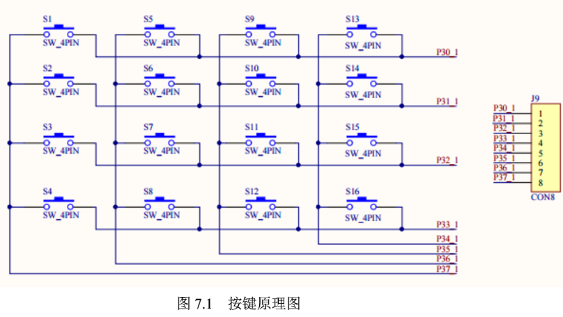
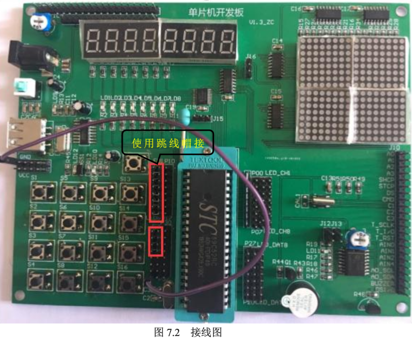

接下来我们以S1为例来分析硬件电平的变化，当我们不按S1时，S1处于断开状态，与S1右端相连的P3口的第0脚的电平为I/O默认的高电平，与之相应的P0寄存器的第0位就为1，当按下S1，S1左右短接通，左端我们接到了GND上，那右端电平也变为低电平，与右端相连,P30也变为低电平，与之相应的P0寄存器的第0位就为0。这样我们得出一个结论：**单片机的P3寄存器的第0位若为1表示按键没按下，若为0表示按键按下。也就是软件上我要判断按键是按下还是没按下，我们可以用C语言中的判断语句判断P3寄存器的第0位为0还是1就行了。**
下面大家自行完成本实验的软件部分。（结合大家完成的情况作出讲解）
讲解本实验的代码：

```c 
#include <reg51.h>
#include <intrins.h>
void main()
{
	unsigned char x,y,r,z,key=0x0f;
	unsigned int i;
	x=0xFE;         //左流水初始化
	y=0x7F;         //右流水初始化
	z=0xfe;         //双向流水初始化
	r=0x7f;
	while(1)
	{
		if((P3 & 0x0f) !=0x0f)	//P3一开始是1111 1111  P3 & 0x0f变成0000 1111，如果有按键按下了，这个状态就会改变（多个0）
		{
			key=P3 & 0x0f;
		}
		if(key==0x0e)      //判断按下的是否为S1
		{
			P1=z;
			for(i=0;i<=10000;i++);       //延时
			z=_crol_(z,1);      //循环左移一位
		}
		else if (key==0x0d)          //判断按下的是否为S2
		{
			P1=r;
			for(i=0;i<=10000;i++);       //延时
			r=_cror_(r,1);      //循环右移一位
		}
		else if (key==0x0b)          //判断按下的是否为S3
		{
			P1=x & y;            
			for(i=0;i<=10000;i++);  //延时
			x=_crol_(x,1);     
			y=_cror_(y,1);     
		}
		else
			P1=0XFF;
	}
}
```


key7接地
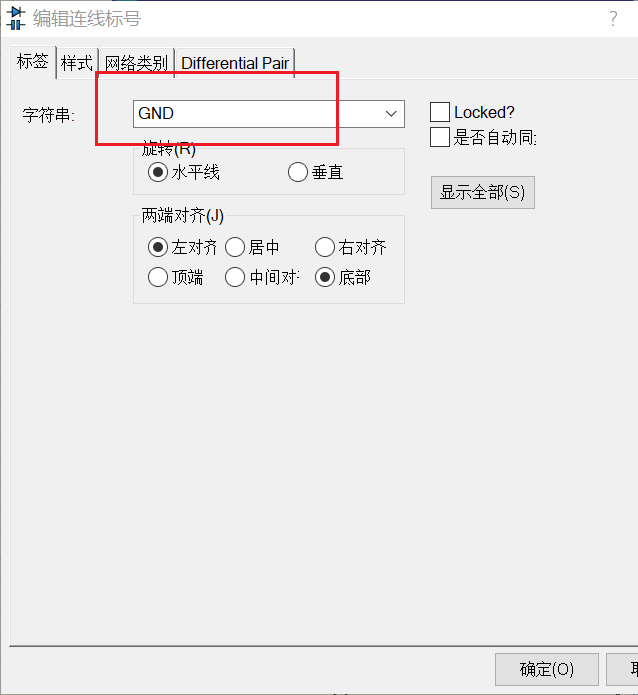

key0，key1，key2，key3是1。key7接地是0。只有按下按钮的时候，才会改变key0，key1，key2，key3，即P30，P31，P32，P33（会变成0）

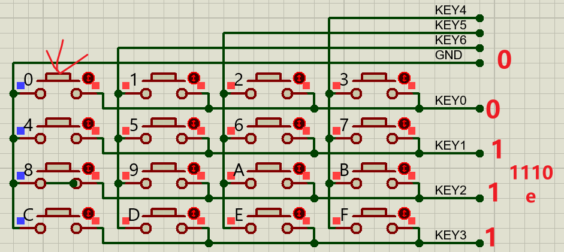

# 08.一个按钮控制流水灯

## 有错误

使用开发板上的一个按键S1，控制LED灯的流水效果。代码如下:

```c
#include <reg51.h>
#include <intrins.h>
sbit S1=P3^0;
void main()
{
	unsigned char x,y,r,z,times=4;
	int i;
	x=0xFE;         //做流水初始化
	y=0x7F;         //右流水初始化
	z=0xfe;         //双向流水初始化
	r=0x7f;
	while(1)
	{  
		if(S1==0)
		{
			times++;
			if(times==5)
				times=1;
		}

		if(times==1)      //判断是否为第一次按下
		{
			P1=z;
			for(i=0;i<=10000;i++);       //延时
			z=_crol_(z,1);      //循环左移一位
		}
		else if (times==2)          ///判断是否为第二次按下
		{
			P1=r;
			for(i=0;i<=10000;i++);       //延时
			r=_cror_(r,1);      //循环右移一位
		}
		else if (times==3)          ///判断是否为第三次按下
		{
			P1=x & y;            
			for(i=0;i<=10000;i++);  //延时
			x=_crol_(x,1);     
			y=_cror_(y,1);     
		}
		else if(times==4)
		{	P1=0XFF;	}
	}
}
```

这段代码看上去很合理，定义一个记录按键按下次数的变量times，times四个取值1、2、3和4，分别对应于向右流水、向左流水、双向流水和关闭状态。这段代码里给times赋了一个初值4，表示LED在开始时为熄灭状态。在主循环的开始CPU先判断按键有没有按下，也就是判断S1是否等于0，若按下就将times加1，然后再判断times的值决定灯的显示效果。这段代码看似没问题，现在大家将这段代码下载到开发板上，大家看看运行现象怎么样。
我们来一起分析一下实验现象。程序运行开始，LED处于熄灭状态，当我们按下S1，LED灯理论上应该是向右流水，但我们发现不一定是这个现象，有时是向右流水，有时是双向流水，有时看不出什么现象。这是为什么呢？因为当我们按下S1，CPU在主循环里第一次判断到S1按下，times累加1，然后根据times值执行一种灯的流水效果，CPU在执行一次灯的流水效果语句时间很短，执行完，又循环上去判断S1，这时我们的手还没来得及放开，CPU又判断了一次S1按下，times又一次累加1，然后下面就执行另一种流水效果，所以就出现了按下一次S1，CPU判断了很多次，造成流水效果错位的现象。要想解决这个问题，我们就需要在给times累加的条件改为CPU首次判断S1按下，如果下次判断S1还是按下的状态，则S1不累加，直到按键抬起再次按下的首次判断times才再累加。那我们怎么判断是首次按下？首次按下包含两个条件：一是首次，二是按下。按下的条件我们只要判断S1是否为0，那怎么知道是首次呢？我们可以定义一个标记变量flag，当没有按键按下，flag赋为0，当我们判断出S1按下，并且flag为0的情况下，那就表示是首次按下，只要是按下，flag就置为1，表示这次按键已经处理过，在flag为1的情况下再次判断按键按下，就不做任何处理。下面大家根据上面的讲解自行改善本实验的软件部分。（30分钟学生实践，教师巡视）
讲解本实验的代码：

## 正确

```c
#include <reg51.h>
#include <intrins.h>
sbit S1=P3^0;
void main()
{
	unsigned char x,y,r,z,times=4,flag=0;
	int i;
	x=0xFE;         //做流水初始化
	y=0x7F;         //右流水初始化
	z=0xfe;         //双向流水初始化
	r=0x7f;
	while(1)
	{  
		if(S1==0)
		{
			if(flag==0)   //判断是否为首次按下
			{
				flag=1;   //只要是按下，flag就置为1
				times++;
				if(times==5)
					times=1;
			}
		}
		else
			flag=0;      //若没有按键按下，将flag清为0
		if(times==1)      //判断是否第一次S1按下
		{
			P1=z;
			for(i=0;i<=10000;i++);       //延时
			z=_crol_(z,1);      //循环左移一位
		}
		else if (times==2)        
		//判断是否第二次S1按下
		{
			P1=r;
			for(i=0;i<=10000;i++);       //延时
			r=_cror_(r,1);      //循环右移一位
		}
		else if (times==3)          //判断是否第三次S1按下
		{
			P1=x & y;            
			for(i=0;i<=10000;i++);  //延时
			x= _crol_(x,1);     
			y=_cror_(y,1);     
		}
		else if(times==4)
			P1=0XFF;
	}
}
```

# 09矩阵按键（用LED灯显示键值二进制）

上次课要求大家课后学习书上关于矩阵按键识别部分的知识点，这次课我们重点介绍矩阵按键应用方法。
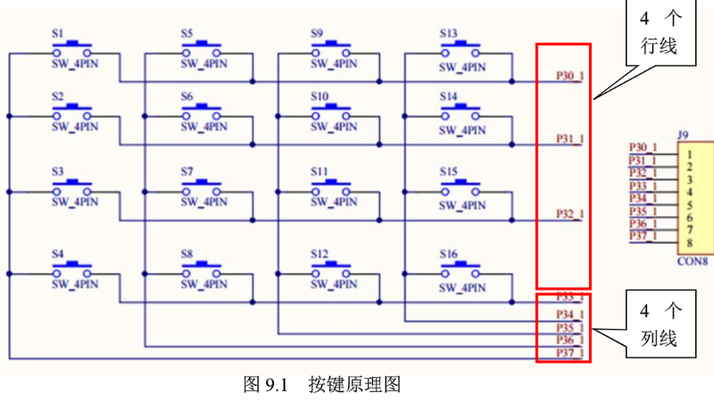

  大家回忆一下我们做过的4个按键控制流水灯效果，共使用了4个I/O脚，我们称这四个按键是独立按键，如果我们需要16个按键，都使用独立按键方法，需要16个I/O脚，这样太浪费I/O资源了，为了节约I/O脚，可以将16个按键按四行、四列排列。图9.1为开发板上按键原理图，该按键模块有四行和四列，组成了16个按键，每一列按键的左边端口接在一起，称为列线，每一行按键的右边端口接在一起，称为行线，本实验我们将四个行线从上到下（也就是第一行到第行）分别接到P3口的第0脚到第3脚，四个列线从上到下（也就是第四列到第一列）分别接到P3口的第4脚到第7脚，P3口的第4脚到第7脚，那单片机如何判断哪个按键按下，可以采用按键扫描法，具体步骤如图9.2所示。
  1、给第一列线也就是P3.7引脚低电平，其他列线及行线引脚输出高电平，也就是给P3输出11111110B扫描值，如果第一列有按键按下，四个行线肯定有一个跟P3.7连上，也就是判断四个行线P3.0到P3.3是否有低电平，若没有转第2步，若有表示第一列有按键按下，再进一步判断P3.0到P3.3具体是哪个引脚为低电平，得出是哪个按键按下，若P3.0是低电平，说明是S1按下，也就是若是S1按下，P3口电平的状态用二进制表示就是01111110，十六进制就是0x7e，我们称0x7e为S1的键值。以此类推S2的键值为0xbe，S3的键值为0xde，S4的键值为0xee。得出S1到S4任意一个键值后结束扫描，无需转第2步；
  2、给第二列线也就是P3.6引脚低电平，其他列线及行线引脚输出高电平，也就是给P3输出11111101B扫描值，如果第二列有按键按下，四个行线肯定有一个跟P3.6连上，也就是判断四个行线P3.0到P3.3是否有低电平，若没有转第3步，若有表示第二列有按键按下，再进一步判断P3.0到P3.3具体是哪个引脚为低电平，得出是哪个按键按下，若P3.0是低电平，说明是S4按下，照1中的方法，得出S4到S8任意一个键值后结束扫描，无需转第2步；
  3、给第三列线也就是P3.5引脚低电平，其他列线及行线引脚输出高电平，也就是给P3输出11111011B扫描值，如果第三列有按键按下，四个行线肯定有一个跟P3.5连上，也就是判断四个行线P3.0到P3.3是否有低电平，若没有转第4步，若有表示第三列有按键按下，再进一步判断P3.0到P3.3具体是哪个引脚为低电平，得出是哪个按键按下，若P3.0是低电平，说明是S9按下，按照1中的方法，得出S9到S12任意一个键值后结束扫描，无需转第2步；
  4、给第四列线也就是P3.4引脚低电平，其他列线及行线引脚输出高电平，也就是给P3输出11110111B扫描值，如果第四列有按键按下，四个行线肯定有一个跟P3.4连上，也就是判断四个行线P3.0到P3.3是否有低电平，若没有表示没有按键按下，结束扫描，若有表示第四列有按键按下，再进一步判断P3.0到P3.3具体是哪个引脚为低电平，得出是哪个按键按下，若P3.0是低电平，说明是S9按下，按照1中的方法，得出S9到S12任意一个键值后结束扫描，无需转第2步；
  按上面的方法，可以写出16个按键的键值，如表9.1所示。
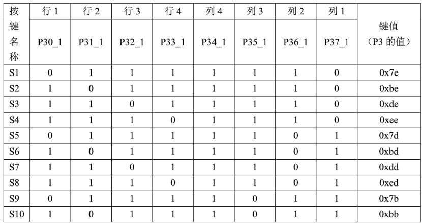
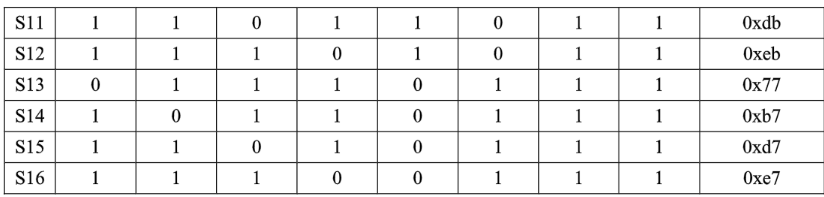
明白了矩阵按键扫描和键值的概念后，我们再了解按键定义值的概念。按键的定义值是指按键在应用中的代表的功能，例如按下S1，希望单片机将它作为数字1处理，那S1的定义值就是1，按下S2，希望单片机将它作为乘号`“*”`处理，那S1的定义值就是`“*”`，也就是定义值是程序员按具体的应用分配的，同一个按键它的键值是唯一不变的，但定义值是可以变化的。下面我们来编程实现上课让大家思考的实验。该实验要求从S1到S16的顺序，将按键定义为1到16，例如S1的定义值为1，S16的键值为16，按下任意键，将该键的定义值以二进制的形式显示在8个LED上，灯亮代表1，灯灭代表0。要实现该实验我们要从两个方面考虑：硬件设计和软件设计。
1、硬件设计
硬件上将矩阵按键的行和列线按行1到行4、列4到列1的顺序分别接到P3口的第0脚到第7脚，8个LED灯分别按顺序接到P1口的8个引脚上。
2、软件设计
1）数据结构
软件上首先我们要定义一个键值和定义值的查询表，可以用数组实现，数组定义的格式为：
`unsigned char code key_table[]={key1键值，key1定义值，……,key16键值，key16定义值};`
这样如果我们获取到键值后可以查该键值，查到键值后，它的下一个数据即为该键值对应的定义值。
注意：该定义的数组的语句中unsigned char后面为什么加了个code？在这里我们先简单介绍一下程序存储器。程序存储器顾名思义是存放程序的存储器，但它不但可以放代码，还可以存放在程序运行过程中一直不变的数据，例如这里的键值和定义值这些数据在程序运行过程中一直不会发生变化，这些数据要是定义在数据存储器RAM区，比较浪费有限的RAM资源。那用C51怎么实现在程序存储器中怎么存放数据呢？下面的C51语句就是实现在程序存储器中存放数据100，该数据占用一个存储单元，存储单元的名称为x：
`unsigned char code x=100;`
上面语句的特点是，在数据类型后加“code”，表示将x分配在程序存储器中，并且要给x初始化数据，初始化的数据是随着代码一起通过下载器写入到程序存储器中，在程序运行过程中，不能改变x的值，例如下面的赋值语句是错误的：`x=56；`因为x是程序存储器中的存储单元，不支持在线写入数据。
2)按键扫描函数
按键扫描函数可以用一个4次循环来实现，具体流程如图9.3所示。

```c
#include <reg51.h>
#include <intrins.h>
unsigned char key_scan(); //申明按键扫描函数
unsigned char code  key_table[]={0x7e,1,//  key1的键值和定义值 0111 1110  
								0x7d,2,  //key2的键值和定义值  0111 1101
								0x7b,3,  //key3的键值和定义值
								0x77,4, //key4的键值和定义值
								0xbe,5,//  key5的键值和定义值
								0xbd,6,  //key6的键值和定义值
								0xbb,7, //key7的键值和定义值
								0xb7,8, //key8的键值和定义值
								0xde,9,//key9的键值和定义值
								0xdd,10,  //key10的键值和定义值
								0xdb,11, //key11的键值和定义值
								0xd7,12, //key12的键值和定义值
								0xee,13,//key13的键值和定义值
								0xed,14,// key14的键值和定义值
								0xeb,15,//key15的键值和定义值
								0xe7,16, };//key16的键值和定义值

void main()
{
	unsigned char key=0x0f,key_num=0xff;
	int i;
	while(1)
	{  
		key=key_scan();
		if(key!=0xff)
		{
			for(i=0;i<32;i=i+2)
			{
				if(key_table[i]==key)
				{
					key_num=key_table[i+1];
					break;
				}
			}
		}
		P1=key_num;		
	}
}


unsigned char key_scan() //按键扫描函数
{
	unsigned char key_value=0xff,n,i;
	n=0xfe;   //1111 1110
	for(i=1;i<=4;i++)
	{
		P3=n;     //赋扫描值
		if(P3!=n)//扫描当前行是否有按键按下
		{
			key_value=P3;//获取扫描值
			break;
		}
		n=(n<<1)|(n>>7);//将扫描值循环左移一位，为下一行扫描做准备
	}
	return key_value; //返回键值
}
```

显示的是1 2 3 4 5.....16

# 10.数码管静态显示

以八段管为例介绍其字段，八段数码管其实是由八个LED灯组成的8字型，如图8.2所示，这八个灯按逆时针方向分别为：a,b,c,d,e,f,g,h。如果要显示“7”字，只需要将a,b,c三个灯点亮即可，如图8.3所示：
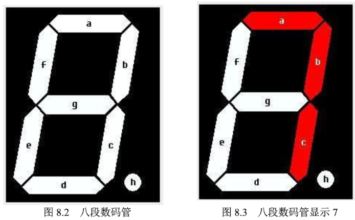

这样来理解的话，要点亮一个数码管很容易，其实就是点亮相应的LED灯，就能显示不同的数字。我们在前面的实验中已经知道怎么点亮开发板上的LED灯，就是用单片机的I/O脚向LED灯输出低电平，灯就能点亮，输出高电平，灯就熄灭。那我们点亮数码管上的LED灯是不是也是这样呢？这就涉及到数码管是共阳极的还是共阴极的。

3、数码管工作原理详解
我们先以一位数码管为例。数码管的共阳极工作方式和共阴极工作方式对初学者而言可能不太好理解，为了加强理解下面把数码管简化，如图8.4所示：

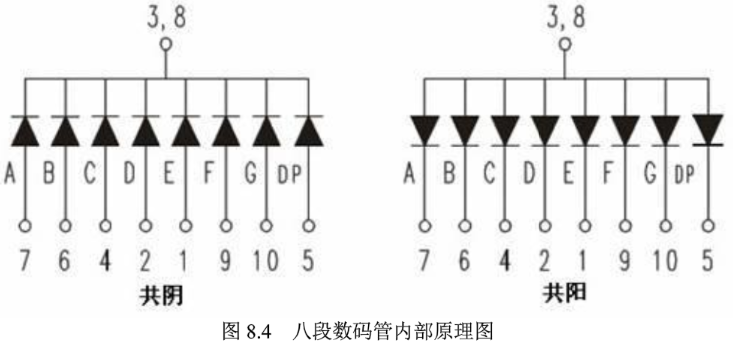

上图中的DP就是前边图中的h，也就是小数点，图中的数字是数码管的引脚，一位数码管管脚如图8.5所示，大家
可以对照看，找到数码管各个字段对应哪个引脚。这里主要看字母。从图中可以看出数码管其实就是多个发光二极管的集合体。
共阴数码管：将发光二极管的阴极共同连接在一起；
共阳数码管：将发光二极管的阳极共同连接在一起；
**对共阳数码管而言，如果要显示“7”字，公共端给高电平，A,B,C给低电平，D,E,F,G,DP给高电平就可以了**。如图8.6所示。
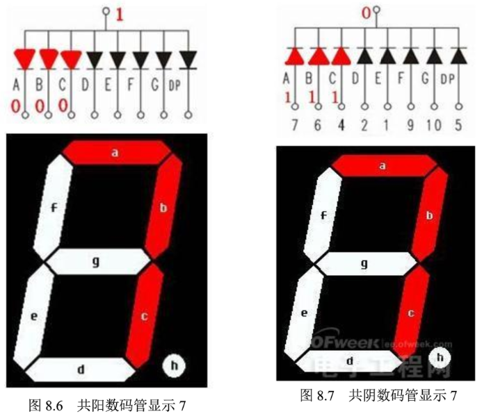

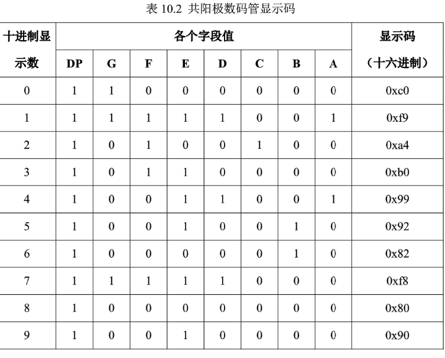

回到我们本次课要完成的实验中来，本次实验我们要实现用程序将开发板上最左边的数码管显示任意的数字。我们还是从两方面考虑：硬件设计和软件设计。
1、硬件设计
本实验板上的数码管使用的是共阴极数码管，硬件上将最左边数码管的共阴极引脚也就是实验板上的LED_CH1插针接到GND上，A到DP段的阳极引脚也就是实验板上的LED_DAT1到LED_DAT8插针按顺序接到P20到P27上。
2、软件设计
1）数据结构
因为显示码在程序运行中不会改变，可以在程序存储器中定义一个显示码数组，数组里的值按从0到9的显示码的顺序存放，定义的格式为：
`unsigned char code display_code[]={0x3f,0x06,0x5b,0x4f,0x66,0x6d,0x7d,0x07,0x7f,0x6f};`
2）软件代码

## 代码

下面是让第一个数码管显示5的程序代码。

```c
#include"REG51.h"
#include"intrins.h"
unsigned char code display_code[]={0xc0,0xf9,0xa4,0xb0,0x99,0x92,0x82,0xf8,0x80,0x90,0xbf};

void main(void)
{  
	unsigned int i;
	P0=0xfe;
	P2=display_code[5];   //将5的显示码赋给P2口，数码管显示5
	while(1);
}
```


# 11.数码管动态显示

上次课我们了解了一位数码管显示数据的原理，但在实际应用中往往需要多位数码管，例如我们要做电子表，我们就需要8位数码管，来显示时、分、秒。当我们需要多位数码管时，我们不需要买多个一位的数码管，可以买多位的数码管，例如两位的或四位的，如图10.2.1所示。本开发板上使用的是两个4位的数码管，我们先来认识一下4位数码管的结构及引脚，图10.2.2为4位数码管引脚图，数码管正面的左下角为第1引脚，按逆时针顺序，左上方第12引脚。

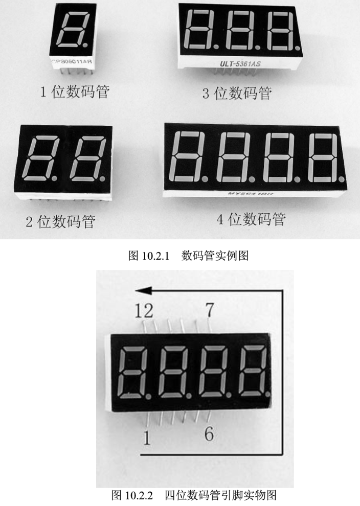

```c
#include"REG51.h"
unsigned char code display_code[]={0x3f,0x06,0x5b,0x4f,0x66,0x6d,0x7d,0x07,0x7f,0x6f};
sbit P00=P0^0;
sbit P01=P0^1;
void main(void)
{ 
	while(1)
	{
		P00=1;
		P01=0;
		P2=display_code[1];   //将1的显示码赋给P2口，第一个数码管显示1
		P00=0;
		P01=1;
		P2=display_code[1];   //将2的显示码赋给P2口，第二个数码管显示2
	}
}
```

  将上面的代码编译下载到实验板上运行，发现两个数码管显示不清楚并且有重影，大家思考一下这是什么原因呢？这是因为上面的代码让一个数码管显示后，显示还没稳定，就立马就关闭，显示另一个数码管。要解决这个问题，需要每个数码管显示后加一定的延时，等显示稳定后，再显示另一个数码管，将上面的代码加上延时代码如下：

  将上面的代码编译下载到实验板上，发现两个数码管是很清楚的显示“1”和“2”，但会跳动，那是因为延时时间太长，人的眼睛存在“视觉驻留效应”，如果，人眼就会感觉到跳动，只有让关闭某位数码管到下次再次点亮的时间间隔小于眼睛的驻留时间，也就是眼睛还没觉察到数码管熄灭，就再次的点亮，就可以给人一种稳定的显示效果。把上面代码中的延时时间缩短，修改代码如下：

```c
#include"REG51.h"
unsigned char code display_code[]={0xc0,0xf9,0xa4,0xb0,0x99,0x92,0x82,0xf8,0x80,0x90,0xbf};
sbit P00=P0^0;
sbit P01=P0^1;

void main(void)
{ 
	unsigned int i;
	while(1) 
	{
		P2=0xff;
		P00=1;
		P01=0;
		P2=display_code[1];   //将1的显示码赋给P2口，第一个数码管显示1
		for(i=0;i<500;i++);  //延时一段时间

		P2=0xff;
		P00=0;
		P01=1;
		P2=display_code[2];   //将2的显示码赋给P2口，第二个数码管显示2
		for(i=0;i<500;i++);    	//延时一段时间
	}
}
```

将上面的代码编译下载到实验板上，发现两个数码管是很清楚、稳定的显示“1”和“2”。我们把上面数码管的显示方法称为数码管动态显示。用数码管显示信息时，由于每个数码管至少需要8 个I/O 口，如果需要多个数码管，则需要太多I/O 口，而单片机的I/O 口是有限的。在实际应用中，一般采用动态显示的方式解决此问题。动态显示的特点是将所有位数码管的段选线并联在一起，由位选线控制是哪一位数码管有效。选亮数码管采用动态扫描显示。所谓动态扫描显示即轮流向各位数码管送出显示码和相应的位选，利用发光管的余辉和人眼视觉暂留作用，使人的感觉好像各位数码管同时都在显示。动态显示的亮度比静态显示要差一些，所以在选择限流电阻时应略小于静态显示电路中的。在动态显示程序中，各个数码管显示的延时时间长短是非常重要的，如果延时时间长，则会出现闪烁现象；如果延时时间太短，则会出现显示暗且有重影。

# 12.八位数码管显示

上次课讲解了数码管动态显示原理，并利用数码管动态显示原理，实现了在两个数码管上同时显示“12”。下面我们讲解上次课布置的作业，在八个数码管上同时显示“12345678”。硬件上，我们顺着两位数码管的显示的硬件连线，将另外六个数码管的选择线LED_CH3到LED_CH8按顺序分别接到P02到P07引脚上。软件上，只要在两位显示的基础上，用同样的方法再增加另外6个数码管的显示，代码如下：

```c
#include"REG51.h"
unsigned char code display_code[]={0xc0,0xf9,0xa4,0xb0,0x99,0x92,0x82,0xf8,0x80,0x90,0xbf};
sbit P00=P0^0;
sbit P01=P0^1;
sbit P02=P0^2;
sbit P03=P0^3;
sbit P04=P0^4;
sbit P05=P0^5;
sbit P06=P0^6;
sbit P07=P0^7;


void main(void)
{ 
	unsigned int i;
	while(1) 
	{
		P2=0xff;//如果不加P2=0xff;的话只会显示1234567，而8是显示不出来的
		P00=0;//选择第一个数码管
		P01=1;
		P02=1;
		P03=1;
		P04=1;
		P05=1;
		P06=1;
		P07=1;
		P2=display_code[1];   //将1的显示码赋给P2口，第一个数码管显示1
		for(i=0;i<500;i++);          	//延时一段时间
		
		P2=0xff;
		P00=1;   
		P01=0;//选择第二个数码管
		P02=1;
		P03=1;
		P04=1;
		P05=1;
		P06=1;
		P07=1;
		P2=display_code[2];   //将2的显示码赋给P2口，第二个数码管显示2
		for(i=0;i<500;i++);          //延时一段时间
		
		P2=0xff;
		P00=1;    
		P01=1;
		P02=0;//选择第三个数码管
		P03=1;
		P04=1;
		P05=1;
		P06=1;
		P07=1;
		P2=display_code[3];   //将3的显示码赋给P2口，第三个数码管显示3
		for(i=0;i<500;i++);        	//延时一段时间

		P00=1;    
		P01=1;
		P02=1;
		P03=0;//选择第四个数码管
		P04=1;
		P05=1;
		P06=1;
		P07=1;
		P2=display_code[4];   //将4的显示码赋给P2口，第四个数码管显示4
		for(i=0;i<500;i++);        	//延时一段时间
		
		P2=0xff;
		P00=1;   
		P01=1;
		P02=1;
		P03=1;
		P04=0;//选择第五个数码管
		P05=1;
		P06=1;
		P07=1;
		P2=display_code[5];   //将5的显示码赋给P2口，第五个数码管显示5
		for(i=0;i<500;i++);    		//延时一段时间
	   
	    P2=0xff;
		P00=1;    
		P01=1;
		P02=1;
		P03=1;
		P04=1;
		P05=0;//选择第六个数码管
		P06=1;
		P07=1;
		P2=display_code[6];   //将6的显示码赋给P2口，第六个数码管显示6
		for(i=0;i<500;i++);          	//延时一段时间
	   
	    P2=0xff;
		P00=1;   
		P01=1;
		P02=1;
		P03=1;
		P04=1;
		P05=1;
		P06=0;//选择第七个数码管
		P07=1;
		P2=display_code[7];   //将7的显示码赋给P2口，第七个数码管显示7
		for(i=0;i<500;i++);          		//延时一段时间
		
		P2=0xff;
		P00=1;    
		P01=1;
		P02=1;
		P03=1;
		P04=1;
		P05=1;
		P06=1;
		P07=0;//选择第八个数码管
		P2=display_code[8];   //将8的显示码赋给P2口，第八个数码管显示8
		for(i=0;i<500;i++);      	//延时一段时间
	}
}
```

```c
//显示87654321
#include <reg51.h>
unsigned char code display_code[]={0xc0,0xf9,0xa4,0xb0,0x99,0x92,0x82,0xf8,0x80,0x90};
unsigned char code display_code2[]={0xfe,0xfd,0xfb,0xf7,0xef,0xdf,0xbf,0x7f};
void main(){

char x;
unsigned int i,j;
while(1){
	

P2=0xff;
P0=display_code2[0];
P2=P2=display_code[8];
for(i=0;i<500;i++);

P2=0xff;
P0=display_code2[1];
P2=display_code[7];
for(i=0;i<500;i++);


P2=0xff;
P0=display_code2[2];
P2=display_code[6];
for(i=0;i<500;i++);

P2=0xff;
P0=display_code2[3];
P2=display_code[5];
for(i=0;i<500;i++);


P2=0xff;
P0=display_code2[4];
P2=display_code[4];
for(i=0;i<500;i++);

P2=0xff;
P0=display_code2[5];
P2=display_code[3];
for(i=0;i<500;i++);

P2=0xff;
P0=display_code2[6];
P2=display_code[2];
for(i=0;i<500;i++);

P2=0xff;
P0=display_code2[7];
P2=display_code[1];
for(i=0;i<500;i++);
}
}
```

现在大家编写上面的代码。将上面的代码编译、下载，开发板的八个数码管能清晰、稳定的显示“12345678”。但我们发现上面的代码太冗余，每个数码管显示的代码是有规律的，选择线上的0是循环左移，显示的数据按顺序是1到8，于是我们可以将上面的代码优化为如下的代码：

```c
#include"REG51.h"
#include"intrins.h"
unsigned char code display_code[]={0xc0,0xf9,0xa4,0xb0,0x99,0x92,0x82,0xf8,0x80,0x90};
void delay(unsigned int  i)
{
	unsigned  int k;
	for(k=0;k<i;k++);
}

void main(void)
{ 
	unsigned char x,i;
	x=0xfe;     //
	while(1) 
	{
		for(i=1;i<=8;i++)
		{
			P2=0xff;
			P0=x;               
			P2=display_code[i];   //将数字i的显示码赋给P2口
			delay(100);          
			x=_crol_(x,1);        
		}
	}
}
```

现在大家实现上面的代码。
大家想想，上面的代码还有没有什么需要推敲的地方？上面的代码是只能显示“12345678”这组数据，但我们实际要显示的数字是变化的、没规律的，为了使程序通用并简洁，可以给八个数码管要显示的数字定义个数组`display_data，如下：unsigned char display_data[8]={1,2,3,4,5,6,7,8};`
这个数组称为显示缓冲区，程序设计时，可以预先将要显示的八个数字按顺序存放到显示缓冲区中，数码管动态显示时，到该缓冲区中取要显示的数字，将上面的代码加上显示缓冲区，优化后的代码如下：

```c
//显示12345678
#include"REG51.h"
#include"intrins.h"
unsigned char code display_code[]={0xc0,0xf9,0xa4,0xb0,0x99,0x92,0x82,0xf8,0x80,0x90};
unsigned char display_data[8]={1,2,3,4,5,6,7,8};  //定义显示缓冲区，赋上要显示的值

void delay(unsigned int  i)
{
	unsigned  int k;
	for(k=0;k<i;k++);
}

void main(void)
{ 
	unsigned char x,i;
	x=0xfe;     //
	while(1) 
	{
		for(i=0;i<8;i++)
		{
			P2=0xff;
			P0=x;               
			//选择一个数码管显示
			P2=display_code[display_data[i]];   //到显示缓冲区中取出第i+1个数码管的
			//显示数字，再到显示码数组中取出对应的显示码，将该显示码送到数据线上。
			delay(100);          	//延时一段时间
			x=_crol_(x,1);       	//将x循环左移一位，准备选择下一个数码管
		}
	}
}
```

现在大家实现上面的代码。
我们知道，主函数一般不实现具体的功能，可以把动态显示数码管的功能放到子函数中实现，代码如下：

```c
#include"REG51.h"
#include"intrins.h"
unsigned char code display_code[]={0xc0,0xf9,0xa4,0xb0,0x99,0x92,0x82,0xf8,0x80,0x90};
unsigned char display_data[8]={1,2,3,4,5,6,7,8};  //定义显示缓冲区，赋上要显示的值
void display_LED();

void delay(unsigned int  i)
{
	unsigned  int k;
	for(k=0;k<i;k++);
}


void main(void)
{ 
	while(1) 
	{
		display_LED();     //调用数码管显示
	}
}
/*
子函数名：display_LED()
函数功能：动态刷新显示八个数码管
*/
void display_LED()     
{
	unsigned char x=0xfe,i;     //
	for(i=0;i<8;i++)
	{
		P2=0xff;
		P0=x;             	//选择一个数码管显示
		P2=display_code[display_data[i]];   
		delay(100);        	//延时一段时间
		x=_crol_(x,1);     	//将x循环左移一位，准备选择下一个数码管
	}
}
```

现在大家实现上面的代码。
上面显示函数是实现八个数码管的刷新，每个数码管的刷新需要延时一段时间，八个数码管加起来的延时时间就比价长了，也就是CPU在该函数中等待的时间比较长，为了提高CPU效率，可以设想让CPU每次刷新显示一个数码管，不在子函数里延时，直接回到主函数处理其他程序，如果主函数没有其他程序处理，就在主函数中延时。要实现这个设想，关键点是要解决两个问题，一是每次调用显示函数，该函数都是刷新的上次显示的数码管的下一个数码管，也就是上面函数中的x要一直存在，而不能回收；二是缓冲区中的数字也要是下一个数码管显示的数字。要解决这两个问题，只需要将x、i定义为静态局部变量就可以了，将上面的代码修改后的代码如下：

```c
#include"REG51.h"
#include"intrins.h"
unsigned char code display_code[]={0xc0,0xf9,0xa4,0xb0,0x99,0x92,0x82,0xf8,0x80,0x90};
unsigned char display_data[8]={1,2,3,4,5,6,7,8};  //定义显示缓冲区，赋上要显示的值
void display_LED();

void delay(unsigned int  i)
{
	unsigned  int k;
	for(k=0;k<i;k++);
}


void main(void)
{ 
	while(1) 
	{
		display_LED();      //调用数码管显示
		delay(100);     	//延时一段时间
	}
}
/*
子函数名：display_LED()
函数功能：动态刷新显示八个数码管
*/
void display_LED()     
{
	static unsigned char x=0xfe,i=0;   
	P2=0xff; 
	P0=x;     	//选择一个数码管显示
	P2=display_code[display_data[i]];
	i=(++i)%8;	//i向后加1，若加到8，从新赋为0
	x=_crol_(x,1);   //将x循环左移一位，准备选择下一个数码管     
	
}
```
# 13.模拟电子表
上次课讲解并整理了数码管刷新显示函数。下面我们讲解上次课布置的作业，在八位的数码管上显示模拟的时间，显示要求是：第一、二个数码管显示小时，第三个数码管不显示，第四、五个数码管显示分钟，第六个数码管不显示，第七、八个数码管显示秒。硬件上和上次实验的连线一样。软件上要定义三个时间变量：hour（小时）、minute(分钟)、second(秒)，并分别赋上模拟时间。要在第一、二个数码管上显示小时，要把小时的十位和个位分别解析到显示缓冲区的第0、第1个元素中；第三个数码管不显示，首先在原来显示码数组最后里加一个元素，赋上不显示的显示码0xff，该元素的下标为10；要在第四、第五个数码管上显示分钟，先要把分钟的十位和个位分别解析到显示缓冲区的第3、第4个空间中；第六个数码管不显示，将10赋给显示缓冲区的第5个元素中；要在第七、第八个数码管上显示秒，先要把秒的十位和个位分别解析到显示缓冲区的第6、第7个空间中。代码如下：

```c
//显示10-35-29
#include"REG51.h"
#include"intrins.h"
void display_LED();//申明数码管显示子函数
unsigned char code display_code[]={0xc0,0xf9,0xa4,0xb0,0x99,0x92,0x82,0xf8,0x80,0x90,0xbf};
unsigned char display_data[8];  //定义显示缓冲区
unsigned char hour=10;   //定义小时
unsigned char minute=35;   //定义分钟
unsigned char second=29;   //定义秒

void delay(unsigned int  i)
{
	unsigned  int k;
	for(k=0;k<i;k++);
}

void main(void)
{ 
	display_data[0]=hour/10;//将小时的十位数送到显示缓冲区第0个元素中
	display_data[1]=hour%10;//将小时的个位数送到显示缓冲区第1个元素中
	display_data[2]=10;
	//将不显示10送到显示缓冲区第2个元素中
	display_data[3]=minute/10;//将分钟的十位数送到显示缓冲区第3个元素中
	display_data[4]=minute%10;//将分钟的个位数送到显示缓冲区第4个元素中
	display_data[5]=10;
	//将不显示10送到显示缓冲区第5个元素中
	display_data[6]=second/10;//将秒的十位数送到显示缓冲区第6个元素中
	display_data[7]=second%10;//将秒的个位数送到显示缓冲区第7个元素中
	while(1) 
	{
		display_LED();     //调用数码管显示，见10-3
		delay(100);          
		//延时一段时间
	}
}

/*
子函数名：display_LED()
函数功能：动态刷新显示八个数码管
*/
void display_LED()     
{
	static unsigned char x=0xfe,i=0;   
	P2=0xff; 
	P0=x;     	//选择一个数码管显示
	P2=display_code[display_data[i]];
	i=(++i)%8;	//i向后加1，若加到8，从新赋为0
	x=_crol_(x,1);   //将x循环左移一位，准备选择下一个数码管     
	
}
```

现在大家实现上面的代码。
上面的实验是在数码管上显示了一个模拟的时间，但时间一直没改变，下面我们模仿时间的计算，做一个模拟电子表。设计思路：秒钟间隔一秒累加1，若加到60，秒清0，分钟累加1，若分钟累加到60，分钟清0，小时累加1，若小时累加到24，小时清0。这里关键要解决的秒钟间隔1秒，这一秒时间怎么来？本次课我们先让CPU做一定的延时来达到，那延时能不能直接安排在主循环里让CPU执行延时1秒的函数呢？因为这个延时时间比较长，不能这样安排，否则会影响数码管的刷新，造成数码管闪烁现象。为了解决这个问题，我们可以不要刻意的让CPU执行延时函数，可以让CPU每执行很多次的主循环后，处理一下时间，这样既能更新时间，又不影响数码显示。于是，定义一个计数变量times，每次主循环执行一次，就累加1，直到累加到一个值，时间刚好是1秒，就处理更新时间函数，这个值是多少，需要我们计算一次循环CPU执行的时间，再根据1秒的时间计算总共执行多少次循环得出，这里我们就不细细计算了，我们假设算出来是500，下面的代码就可以实现一个模拟的电子表了。

```c
//显示C   238.5
#include"REG51.h"
#include"intrins.h"
#include "stdio.h"
void SEG_refresh(unsigned char *p);
void char_to_code();

unsigned char code display_code[]={'C',0xc6,' ',0xff,'0',0xc0,'1',0xf9,'2',0xa4,'3',0xb0,'4',0x99,'5',0x92,'6',0x82,'7',0xf8,'8',0x80,'9',0x90,'-',0xbf};

float t=234.5;
char hour=11,min=13,sec=56;
char display_dat[8];
char display_char[10];

void main()
{
	unsigned int j;
	sprintf(display_char,"C   %.1f",t);		 //将C   234.5输入到display_char数组里面
	char_to_code();

	while(1)
	{
		SEG_refresh(display_dat);
		for(j=0;j<500;j++);
	
	}
}

void SEG_refresh(unsigned char *p)
{
	static char x=0xfe;	   // 1111 1110
	static unsigned int i=0;

	P2=0xff;
	P0=x;
	P2=p[i];
	x=_crol_(x,1);
	i++;
	if(i==8)  i=0;

}

void char_to_code()
{
	unsigned int i,j,k;
	for(k=0,j=0;k<8;j++,k++)
	{
		  for(i=0;i<13;i++)
		  {
		  	if(display_char[j]==display_code[2*i])
			{
				display_dat[k]=display_code[2*i+1];
				break;
			}
			if(display_char[j+1]=='.')
			{
				display_dat[k]=display_dat[k] & 0x7f;//将最高位置为0，即显示小数点		  
				j++;
			}
		  }
	}
}
```

```c
#include"REG51.h"
#include"intrins.h"
#include "stdio.h"
void SEG_refresh(unsigned char *p);
void char_to_code(unsigned char *p,unsigned char *q);

unsigned char code display_code[]={'C',0xc6,' ',0xff,'0',0xc0,'1',0xf9,'2',0xa4,'3',0xb0,'4',0x99,'5',0x92,'6',0x82,'7',0xf8,'8',0x80,'9',0x90,'-',0xbf};

float t=234.5;
char hour=11,min=13,sec=56;
char display_dat[8];
char display_char[10];

void main()
{
	unsigned int j;
	sprintf(display_char,"C   %.1f",t);		 //将C   234.5输入到display_char数组里面
	char_to_code(display_char,display_dat);

	while(1)
	{
		SEG_refresh(display_dat);
		for(j=0;j<500;j++);
	
	}
}

void SEG_refresh(unsigned char *p)
{
	static char x=0xfe;	   // 1111 1110
	static unsigned int i=0;

	P2=0xff;
	P0=x;
	P2=p[i];
	x=_crol_(x,1);
	i++;
	if(i==8)  i=0;

}

void char_to_code(unsigned char *p,unsigned char *q)	 //	display_char是p,display_dat是q
{
	unsigned int i,j,k;
	for(k=0,j=0;k<8;j++,k++)
	{
		  for(i=0;i<13;i++)
		  {
		  	if(p[j]==display_code[2*i])
			{
				q[k]=display_code[2*i+1];
				break;
			}
			if(p[j+1]=='.')
			{
				q[k]=q[k] & 0x7f;//将最高位置为0，即显示小数点		  
				j++;
			}
		  }
	}
}
```

拆分成3个文件写

```c
//1.c
#include"REG51.h"
#include"intrins.h"
#include "stdio.h"
#include "seg.h"


//unsigned char code display_code[]={'C',0xc6,' ',0xff,'0',0xc0,'1',0xf9,'2',0xa4,'3',0xb0,'4',0x99,'5',0x92,'6',0x82,'7',0xf8,'8',0x80,'9',0x90,'-',0xbf};

float t=234.5;
char hour=11,min=13,sec=56;
char display_dat[8];
char display_char[10];

void main()
{
	unsigned int j;
	sprintf(display_char,"C   %.1f",t);		 //将C   234.5输入到display_char数组里面
	char_to_code(display_char,display_dat);

	while(1)
	{
		SEG_refresh(display_dat);
		for(j=0;j<500;j++);
	
	}
}
```

```c
//seg.h
void SEG_refresh(unsigned char *p);
void char_to_code(unsigned char *p,unsigned char *q);
```

```c
//seg.c
#include"REG51.h"
#include"intrins.h"
#include "stdio.h"
#include "seg.h"

unsigned char code display_code[]={'C',0xc6,' ',0xff,'0',0xc0,'1',0xf9,'2',0xa4,'3',0xb0,'4',0x99,'5',0x92,'6',0x82,'7',0xf8,'8',0x80,'9',0x90,'-',0xbf};

void SEG_refresh(unsigned char *p)
{
	static char x=0xfe;	   // 1111 1110
	static unsigned int i=0;

	P2=0xff;
	P0=x;
	P2=p[i];
	x=_crol_(x,1);
	i++;
	if(i==8)  i=0;

}

void char_to_code(unsigned char *p,unsigned char *q)	 //	display_char是p,display_dat是q
{
	unsigned int i,j,k;
	for(k=0,j=0;k<8;j++,k++)
	{
		  for(i=0;i<13;i++)
		  {
		  	if(p[j]==display_code[2*i])
			{
				q[k]=display_code[2*i+1];
				break;
			}
			if(p[j+1]=='.')
			{
				q[k]=q[k] & 0x7f;//将最高位置为0，即显示小数点		  
				j++;
			}
		  }
	}
}
```


```c
//显示11-13-56
#include<REG51.h>
#include<intrins.h>
#include <stdio.h>
#include "seg.h"


char hour=11,min=13,sec=56;
char display_dat[8];
char display_char[10];

void main()
{
	unsigned int j;
	sprintf(display_char,"%02d-%02d-%02d",(int)hour,(int)min,(int)sec);		 //将C   234.5输入到display_char数组里面
	char_to_code(display_char,display_dat);

	while(1)
	{
		SEG_refresh(display_dat);
		for(j=0;j<500;j++);	
	}
}
```

# 14.倒计时

  上次课我们利用CPU的延时做了一个模拟的电子表，使用CPU的延时得到秒时间，计算比较复杂，如果主循环的代码改变，需要用重新计算循环次数，若用1秒的延时函数，又会减低CPU的效率，不能及时刷新数码管，造成数码管不能正常显示。这次课我们来解决这个问题。
  就好比我们人要想得到一个准确的时间，我们必须要靠手表、手机等时间工具，单片机中的CPU要获取一个准确的时间，它可以使用单片机里的提供的工具，就是定时/计数器模块。51单片机内部有两个定时/计数器，分别是定时/计数器0（记为T0），定时/计数器1（记为T1），我们只要掌握T0的使用方法，T1也就掌握了，因为他们的使用方法都差不多，所以本节我们重点介绍T0的使用，解决CPU如何利用T0得到1秒钟的时间这个问题，做出9秒倒计时实验。
  T0是集成在我们单片机内部的功能模块，看不见、摸不着，比较抽象，但我们可以形象的去理解，大家都有在自己手机上调闹钟的经历吧，而且不需要别人教，直接就会用，因为在手机上设置闹钟是看得见、摸得着的，先找到闹钟界面，然后设置时间，再启动闹钟，最后等待闹钟铃声响起，知道设置的时间到。其实使用单片机中T0的方法跟手机设置闹钟类似，首先设置T0定时时间，再启动T0，最后等待定时器时间到，只是这些过程的设置比
较抽象，首先要找到设置的特殊功能寄存器，了解每个特殊位的含义，用C51语句进行设置，下面我们按照上面所说的步骤详细介绍T0使用方法。
一、设置时间
  我们在手机上设置定时时间很容易，因为手机上显示的就是时间单位，很形象。那设置T0的定时时间也这么容易吗？我们必须要掌握T0的定时原理。T0其实是通过数数达到定时目的，T0里有两个特殊功能寄存器TH0(0X8C)和TL0(0X8A)，他们可以一起并为16位的寄存器，TH0为高8位，TL0为低8位，假设初始值为0，如图10.5.1所示：
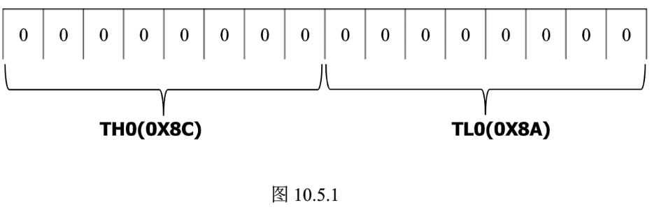

这16位寄存器的特殊功能就体现在，只要T0启动，这16位寄存器会隔一段时间自动累加1，直到累加到全1，如图10.5.2所示。

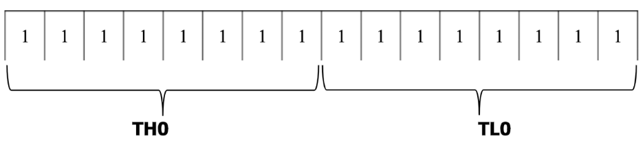

若再累加一次，这16的寄存器就会溢出，变为0，溢出的1将会存放在内存地址0x88处的TCON寄存器中的第5位（计作TF0位），该位称为T0的溢出标志位，该位是CPU判断定时器是否定时时间到的关键标志，如图10.5.3所示。
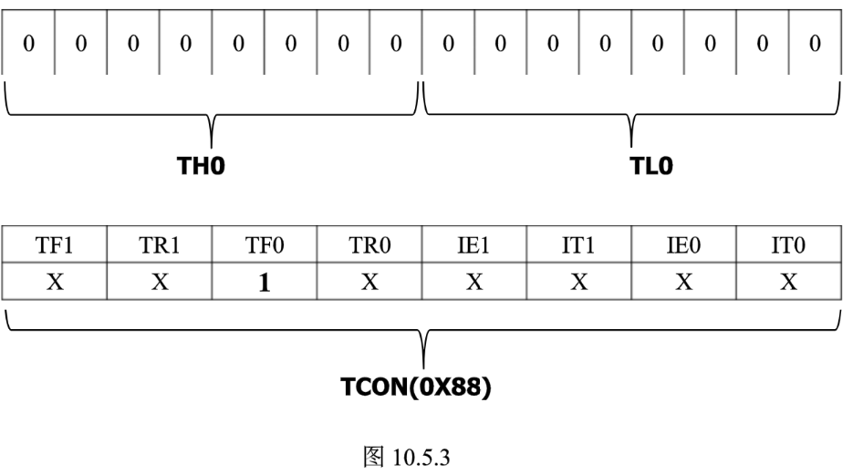

通过对T0原理的理解，我们明白了，要想让T0定时一定的时间，只要根据要定时的时间t和T0累加的周期T算出需要让T0累加多少次。定时时间是已知的，T0累加的周期T是多少呢？T0的全称为定时/计数器0，也就是T0有定时和计数两个功能，T0的累加周期是由它的功能决定的：作为计数功能，它的累加频率是由P3.4引脚输入的脉冲决定的，我们会在后续的实验中详细讲解；本次实验我们选用定时功能，T0的累加频率f是单片机晶振频率（计作fosc）的1/12，本开发板单片机的晶振频率为12MHZ，那T0作为定时功能时，累加频率f为1MHZ，累加周期T为1/f，这样我们可以算出T0最大定时时间为：
`tmax=2^16*T=65536/f=65536/106=0.065536s`
也就是T0最大定时时间为0.065536秒，而本实验我们需要定时1秒，远远大于最大的定时时间，只能让T0定时多次达到，既然是多次，那次数我们一般取个整，我们可以选用让T0每次定时0.05秒，定时20次，则为1秒。接下来我们来算要想让定时器定时0.05s，定时器需要累加多少个数，我们设为x
`t=x*Tm`
`x=t/Tm=t*fosc/12=0.05*12M/12=50000`
我们如何让T0知道我们想让它累加50000个数呢？我们上面介绍到了TF0溢出标志位，T0累加到溢出时，该位被自动置为1，也就是CPU可以通过该位判断出T0是否溢出，若我们让T0从0开始数，当T0累加到50000时，我们无法判断，可以选择让T0从某个初值y开始累加，累加到溢出时刚好累加了50000次，溢出CPU是可以判断的。这个初值y很好计算，只要将最大的累加次数减去50000，y的计算过程如下：
`y=216-x=65536-50000=15536=0x3cb0`
计算出y后，我们把y的高8位赋给TH0，低8位赋给TL0，代码如下所示：

```c
TH0=0x4c；
TL0=0x00；
```

大家别忘了，我们计算到现在是有前提条件的，其中一个前提条件是我们使用的是定时功能，我们如何将T0设置为定时功能呢？另外我们公式里使用的是216，其实这里的16还有两个选择，13和8，我们如何设置为16呢？我们下面来学习定时器的一个特殊的功能寄存器TMOD，图10.5.4为TMOD寄存器各位的含义，下面我具体介绍。
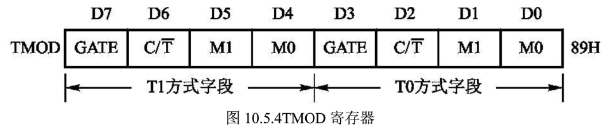

```c
//递增变换1234567890
#include"REG51.h"
#include"intrins.h"
unsigned char code display_code[]={0xc0,0xf9,0xa4,0xb0,0x99,0x92,0x82,0xf8,0x80,0x90,0xbf};
void main(void)
{ 
	char i,j=9;
	TMOD=0x01;      	//设置T0打开方式为软件启动，定时功能，16位方式
	P0=0xfe;            //选择第一个数码管
	while(1)
	{	
		P2=display_code[j];   //将j的显示码赋给P2口，数码管显示j
		for(i=0;i<20;i++)      //使用定时器定时1秒
		{
			
			TH0=0x3c;
			TL0=0xb0;
			TR0=1;
			while(TF0==0);
			TF0=0;
		}
		j=(++j)%10;          //处理下一个要显示的数
	}
}
```


